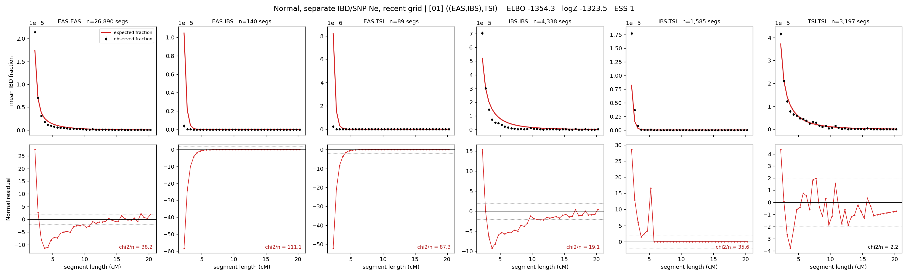

# `((EAS,IBS),TSI)`

**Normal, separate IBD/SNP Ne, recent grid** | topology 01 of 21 | tree (no admixture) | 2 events, 5 nodes

> Recent Ne grid: 0-5 and 5-10 generations. The first demographic event is explicitly constrained to occur after generation 10 (minimum 11 with the current one-generation gap).

## Model score

| quantity | value | |
|---|---|---|
| ELBO | -1354.29 | +- 0.30 (MC) |
| logZ (importance sampling) | -1323.48 | |
| ESS of the IS weights | 1.1 / 4000 | LOW -- treat logZ with suspicion |
| Stan dropped-constant correction | -26.08 | already applied |
| seed kept / runtime | 7 | 15 s |

## Events (in temporal order, most recent first)

| # | type | detail | time (gen) | cumulative |
|---|---|---|---|---|
| 1 | MERGE | EAS + IBS -> n1 | 157.7 +- 0.9 | 157.7 |
| 2 | MERGE | n1 + TSI -> root | 3.4 +- 0.1 | 161.0 |

## Recent effective sizes for IBD (haploid)

| population | 0-5 gen | 5-10 gen |
|---|---:|---:|
| `EAS` | 27,294,543 | 19,304,771 |
| `IBS` | 3,521,283 | 2,297,493 |
| `TSI` | 2,299,704 | 1,542,128 |

## Effective sizes for IBD (haploid)

| node | Ne | sd of log Ne |
|---|---|---|
| `EAS` | 1,385,111 | 0.05 |
| `IBS` | 231,209 | 0.04 |
| `TSI` | 333,352 | 0.04 |
| `n1` | 14,200 | 0.04 |
| `root` | 33,077 | 0.03 |

log-Ne random-walk step scale tau_ibd = 2.371

## Recent effective sizes for SNP (haploid)

| population | 0-5 gen | 5-10 gen |
|---|---:|---:|
| `EAS` | 920 | 912 |
| `IBS` | 134,364 | 133,175 |
| `TSI` | 118,085 | 117,260 |

## Effective sizes for SNP (haploid)

| node | Ne | sd of log Ne |
|---|---|---|
| `EAS` | 872 | 0.01 |
| `IBS` | 127,452 | 0.07 |
| `TSI` | 114,031 | 0.09 |
| `n1` | 17,182 | 0.01 |
| `root` | 18,117 | 0.01 |

log-Ne random-walk step scale tau_snp = 1.097

## Fit quality by component

| component | log-likelihood | n terms | chi2/n |
|---|---|---|---|
| IBD | -1,176.9 | 222 | 49.07 |
| SNP | +38.0 | 6 | 1.88 |

IBD chi2/n uses Palamara model-derived Normal variance; SNP chi2/n uses its block SEs. Values near 1 indicate residuals on the modeled noise scale.

## SNP covariance residuals `(w_hat - W_pred)/w_se`

| | EAS | IBS | TSI |
|---|---|---|---|
| **EAS** | +0.01 | -0.12 | +0.11 |
| **IBS** | -0.12 | +0.04 | +0.21 |
| **TSI** | +0.11 | +0.21 | -0.42 |

