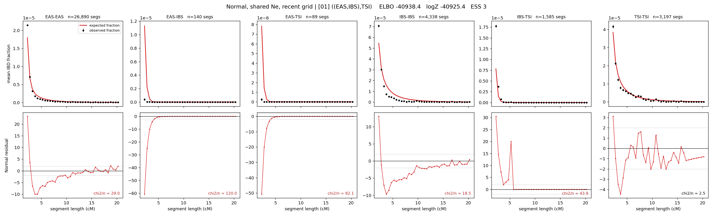

# `((EAS,IBS),TSI)`

**Normal, shared Ne, recent grid** | topology 01 of 21 | tree (no admixture) | 2 events, 5 nodes

> Recent Ne grid: 0-5 and 5-10 generations. The first demographic event is explicitly constrained to occur after generation 10 (minimum 11 with the current one-generation gap).

## Model score

| quantity | value | |
|---|---|---|
| ELBO | -40938.43 | +- 0.17 (MC) |
| logZ (importance sampling) | -40925.39 | |
| ESS of the IS weights | 2.5 / 4000 | LOW -- treat logZ with suspicion |
| Stan dropped-constant correction | -17.65 | already applied |
| seed kept / runtime | 1 | 8 s |

## Events (in temporal order, most recent first)

| # | type | detail | time (gen) | cumulative |
|---|---|---|---|---|
| 1 | MERGE | EAS + IBS -> n1 | 163.5 +- 0.2 | 163.5 |
| 2 | MERGE | n1 + TSI -> root | 2.7 +- 0.1 | 166.2 |

## Recent effective sizes shared by IBD and SNP (haploid)

| population | 0-5 gen | 5-10 gen |
|---|---:|---:|
| `EAS` | 28,746,664 | 17,037,919 |
| `IBS` | 2,625,310 | 1,774,019 |
| `TSI` | 1,519,193 | 1,150,332 |

## Effective sizes shared by IBD and SNP (haploid)

| node | Ne | sd of log Ne |
|---|---|---|
| `EAS` | 1,450,755 | 0.02 |
| `IBS` | 223,675 | 0.03 |
| `TSI` | 318,286 | 0.07 |
| `n1` | 6,191 | 0.02 |
| `root` | 29,261 | 0.02 |

log-Ne random-walk step scale tau = 2.464

## Fit quality by component

| component | log-likelihood | n terms | chi2/n |
|---|---|---|---|
| IBD | -1,209.2 | 222 | 49.43 |
| SNP | -39,589.3 | 6 | 13210.96 |

IBD chi2/n uses Palamara model-derived Normal variance; SNP chi2/n uses its block SEs. Values near 1 indicate residuals on the modeled noise scale.

## SNP covariance residuals `(w_hat - W_pred)/w_se`

| | EAS | IBS | TSI |
|---|---|---|---|
| **EAS** | +117.33 | -115.60 | -116.31 |
| **IBS** | -115.60 | +111.62 | +116.33 |
| **TSI** | -116.31 | +116.33 | +112.32 |

