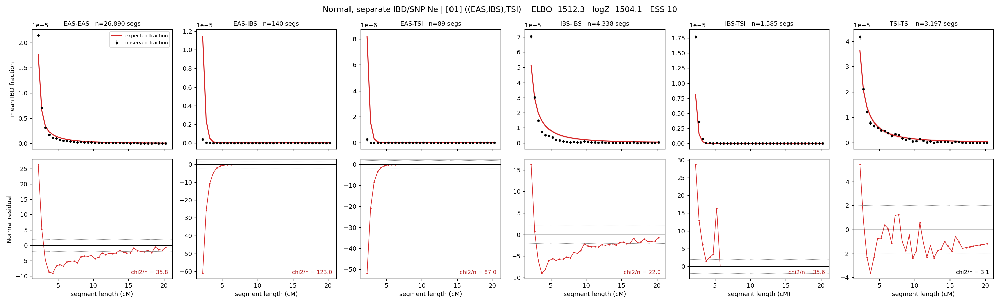

# `((EAS,IBS),TSI)`

**Normal, separate IBD/SNP Ne** | topology 01 of 21 | tree (no admixture) | 2 events, 5 nodes

## Model score

| quantity | value | |
|---|---|---|
| ELBO | -1512.30 | +- 0.10 (MC) |
| logZ (importance sampling) | -1504.07 | |
| ESS of the IS weights | 9.5 / 4000 | LOW -- treat logZ with suspicion |
| Stan dropped-constant correction | -15.06 | already applied |
| mode kept / MAP start / runtime | 1 / 6 | 11 s |
| mode search | 12/12 MAP starts succeeded | 3 distinct modes evaluated |

## Events (in temporal order, most recent first)

| # | type | detail | time (gen) | cumulative |
|---|---|---|---|---|
| 1 | MERGE | EAS + IBS -> n1 | 155.0 +- 0.4 | 155.0 |
| 2 | MERGE | n1 + TSI -> root | 5.3 +- 0.1 | 160.3 |

## Effective sizes for IBD (haploid)

| node | Ne | sd of log Ne |
|---|---|---|
| `EAS` | 1,587,621 | 0.02 |
| `IBS` | 244,022 | 0.03 |
| `TSI` | 347,539 | 0.03 |
| `n1` | 16,141 | 0.01 |
| `root` | 34,025 | 0.01 |

log-Ne random-walk step scale tau_ibd = 1.329

## Effective sizes for SNP (haploid)

| node | Ne | sd of log Ne |
|---|---|---|
| `EAS` | 860 | 0.01 |
| `IBS` | 114,482 | 0.10 |
| `TSI` | 132,437 | 0.10 |
| `n1` | 17,432 | 0.01 |
| `root` | 18,809 | 0.01 |

log-Ne random-walk step scale tau_snp = 1.001

## Fit quality by component

| component | log-likelihood | n terms | chi2/n |
|---|---|---|---|
| IBD | -1,432.6 | 222 | 51.14 |
| SNP | +42.1 | 6 | 0.50 |

IBD chi2/n uses Palamara model-derived Normal variance; SNP chi2/n uses its block SEs. Values near 1 indicate residuals on the modeled noise scale.

## SNP covariance residuals `(w_hat - W_pred)/w_se`

| | EAS | IBS | TSI |
|---|---|---|---|
| **EAS** | +0.03 | -0.04 | -0.02 |
| **IBS** | -0.04 | -0.19 | +0.29 |
| **TSI** | -0.02 | +0.29 | -0.25 |

