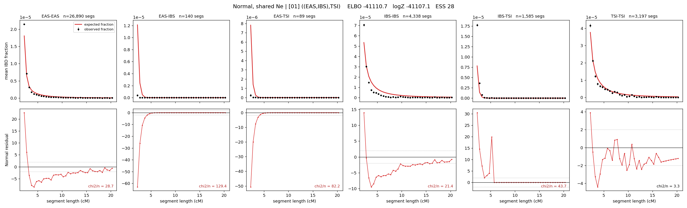

# `((EAS,IBS),TSI)`

**Normal, shared Ne** | topology 01 of 21 | tree (no admixture) | 2 events, 5 nodes

## Model score

| quantity | value | |
|---|---|---|
| ELBO | -41110.71 | +- 0.07 (MC) |
| logZ (importance sampling) | -41107.14 | |
| ESS of the IS weights | 28.1 / 4000 | LOW -- treat logZ with suspicion |
| Stan dropped-constant correction | -12.13 | already applied |
| mode kept / MAP start / runtime | 3 / 11 | 8 s |
| mode search | 12/12 MAP starts succeeded | 3 distinct modes evaluated |

## Events (in temporal order, most recent first)

| # | type | detail | time (gen) | cumulative |
|---|---|---|---|---|
| 1 | MERGE | EAS + IBS -> n1 | 162.1 +- 1.0 | 162.1 |
| 2 | MERGE | n1 + TSI -> root | 3.9 +- 0.4 | 166.0 |

## Effective sizes shared by IBD and SNP (haploid)

| node | Ne | sd of log Ne |
|---|---|---|
| `EAS` | 1,638,743 | 0.03 |
| `IBS` | 235,495 | 0.02 |
| `TSI` | 327,858 | 0.02 |
| `n1` | 7,447 | 0.12 |
| `root` | 29,456 | 0.03 |

log-Ne random-walk step scale tau = 1.587

## Fit quality by component

| component | log-likelihood | n terms | chi2/n |
|---|---|---|---|
| IBD | -1,460.2 | 222 | 51.48 |
| SNP | -39,570.0 | 6 | 13204.53 |

IBD chi2/n uses Palamara model-derived Normal variance; SNP chi2/n uses its block SEs. Values near 1 indicate residuals on the modeled noise scale.

## SNP covariance residuals `(w_hat - W_pred)/w_se`

| | EAS | IBS | TSI |
|---|---|---|---|
| **EAS** | +117.32 | -115.64 | -116.25 |
| **IBS** | -115.64 | +111.57 | +116.46 |
| **TSI** | -116.25 | +116.46 | +112.10 |

