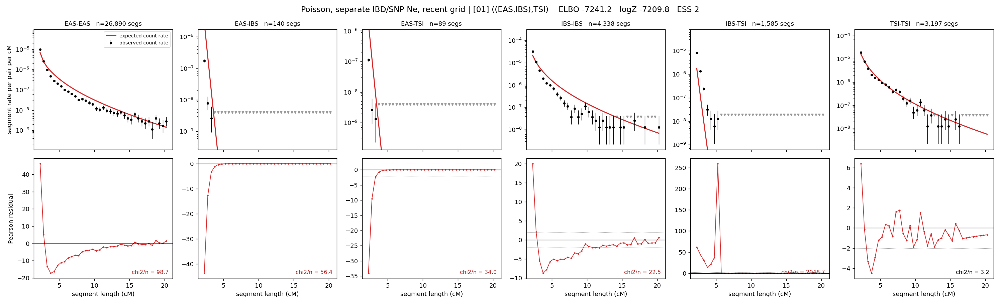

# `((EAS,IBS),TSI)`

**Poisson, separate IBD/SNP Ne, recent grid** | topology 01 of 21 | tree (no admixture) | 2 events, 5 nodes

> Recent Ne grid: 0-5 and 5-10 generations. The first demographic event is explicitly constrained to occur after generation 10 (minimum 11 with the current one-generation gap).

## Model score

| quantity | value | |
|---|---|---|
| ELBO | -7241.24 | +- 0.48 (MC) |
| logZ (importance sampling) | -7209.83 | |
| ESS of the IS weights | 2.0 / 4000 | LOW -- treat logZ with suspicion |
| Stan dropped-constant correction | -26.08 | already applied |
| seed kept / runtime | 7 | 14 s |

## Events (in temporal order, most recent first)

| # | type | detail | time (gen) | cumulative |
|---|---|---|---|---|
| 1 | MERGE | EAS + IBS -> n1 | 233.5 +- 0.7 | 233.5 |
| 2 | MERGE | n1 + TSI -> root | 6.3 +- 0.1 | 239.8 |

## Recent effective sizes for IBD (haploid)

| population | 0-5 gen | 5-10 gen |
|---|---:|---:|
| `EAS` | 45,408,942 | 26,027,480 |
| `IBS` | 6,920,714 | 4,152,269 |
| `TSI` | 5,151,020 | 2,981,333 |

## Effective sizes for IBD (haploid)

| node | Ne | sd of log Ne |
|---|---|---|
| `EAS` | 1,093,122 | 0.03 |
| `IBS` | 237,164 | 0.05 |
| `TSI` | 312,644 | 0.05 |
| `n1` | 1,874 | 0.03 |
| `root` | 4,785 | 0.03 |

log-Ne random-walk step scale tau_ibd = 2.633

## Recent effective sizes for SNP (haploid)

| population | 0-5 gen | 5-10 gen |
|---|---:|---:|
| `EAS` | 1,994 | 1,769 |
| `IBS` | 198,157 | 191,178 |
| `TSI` | 210,696 | 206,969 |

## Effective sizes for SNP (haploid)

| node | Ne | sd of log Ne |
|---|---|---|
| `EAS` | 1,278 | 0.02 |
| `IBS` | 162,590 | 0.06 |
| `TSI` | 194,696 | 0.08 |
| `n1` | 20,819 | 0.02 |
| `root` | 24,667 | 0.02 |

log-Ne random-walk step scale tau_snp = 0.933

## Fit quality by component

| component | log-likelihood | n terms | chi2/n |
|---|---|---|---|
| IBD | -7,026.4 | 222 | 378.95 |
| SNP | +30.9 | 6 | 4.23 |

IBD chi2/n uses Poisson counting variance; SNP chi2/n uses its block SEs. Values near 1 indicate residuals on the modeled noise scale.

## SNP covariance residuals `(w_hat - W_pred)/w_se`

| | EAS | IBS | TSI |
|---|---|---|---|
| **EAS** | +0.06 | -0.05 | -0.07 |
| **IBS** | -0.05 | -0.32 | +0.43 |
| **TSI** | -0.07 | +0.43 | -0.27 |

