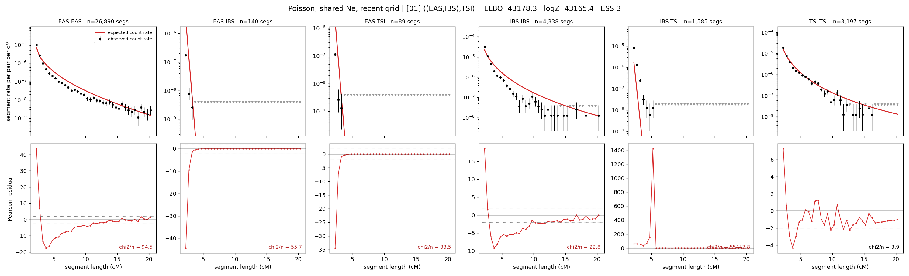

# `((EAS,IBS),TSI)`

**Poisson, shared Ne, recent grid** | topology 01 of 21 | tree (no admixture) | 2 events, 5 nodes

> Recent Ne grid: 0-5 and 5-10 generations. The first demographic event is explicitly constrained to occur after generation 10 (minimum 11 with the current one-generation gap).

## Model score

| quantity | value | |
|---|---|---|
| ELBO | -43178.31 | +- 0.14 (MC) |
| logZ (importance sampling) | -43165.41 | |
| ESS of the IS weights | 3.3 / 4000 | LOW -- treat logZ with suspicion |
| Stan dropped-constant correction | -17.65 | already applied |
| seed kept / runtime | 7 | 7 s |

## Events (in temporal order, most recent first)

| # | type | detail | time (gen) | cumulative |
|---|---|---|---|---|
| 1 | MERGE | EAS + IBS -> n1 | 291.3 +- 0.4 | 291.3 |
| 2 | MERGE | n1 + TSI -> root | 6.2 +- 0.1 | 297.5 |

## Recent effective sizes shared by IBD and SNP (haploid)

| population | 0-5 gen | 5-10 gen |
|---|---:|---:|
| `EAS` | 62,732,960 | 27,520,089 |
| `IBS` | 892,851 | 699,613 |
| `TSI` | 550,458 | 488,480 |

## Effective sizes shared by IBD and SNP (haploid)

| node | Ne | sd of log Ne |
|---|---|---|
| `EAS` | 1,080,678 | 0.03 |
| `IBS` | 231,460 | 0.03 |
| `TSI` | 323,148 | 0.03 |
| `n1` | 218 | 0.02 |
| `root` | 563 | 0.02 |

log-Ne random-walk step scale tau = 1.669

## Fit quality by component

| component | log-likelihood | n terms | chi2/n |
|---|---|---|---|
| IBD | -7,128.5 | 222 | 9300.40 |
| SNP | -35,882.1 | 6 | 11975.25 |

IBD chi2/n uses Poisson counting variance; SNP chi2/n uses its block SEs. Values near 1 indicate residuals on the modeled noise scale.

## SNP covariance residuals `(w_hat - W_pred)/w_se`

| | EAS | IBS | TSI |
|---|---|---|---|
| **EAS** | +112.55 | -124.20 | -98.17 |
| **IBS** | -124.20 | +93.00 | +153.84 |
| **TSI** | -98.17 | +153.84 | +42.46 |

