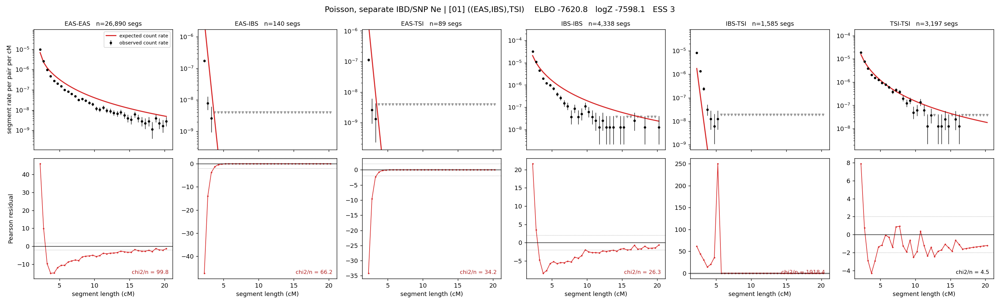

# `((EAS,IBS),TSI)`

**Poisson, separate IBD/SNP Ne** | topology 01 of 21 | tree (no admixture) | 2 events, 5 nodes

## Model score

| quantity | value | |
|---|---|---|
| ELBO | -7620.84 | +- 0.36 (MC) |
| logZ (importance sampling) | -7598.11 | |
| ESS of the IS weights | 3.4 / 4000 | LOW -- treat logZ with suspicion |
| Stan dropped-constant correction | -15.06 | already applied |
| seed kept / runtime | 1 | 9 s |

## Events (in temporal order, most recent first)

| # | type | detail | time (gen) | cumulative |
|---|---|---|---|---|
| 1 | MERGE | EAS + IBS -> n1 | 229.1 +- 0.3 | 229.1 |
| 2 | MERGE | n1 + TSI -> root | 9.5 +- 0.3 | 238.6 |

## Effective sizes for IBD (haploid)

| node | Ne | sd of log Ne |
|---|---|---|
| `EAS` | 1,228,562 | 0.02 |
| `IBS` | 253,873 | 0.03 |
| `TSI` | 329,983 | 0.06 |
| `n1` | 2,267 | 0.01 |
| `root` | 4,957 | 0.01 |

log-Ne random-walk step scale tau_ibd = 1.396

## Effective sizes for SNP (haploid)

| node | Ne | sd of log Ne |
|---|---|---|
| `EAS` | 1,271 | 0.02 |
| `IBS` | 170,473 | 0.11 |
| `TSI` | 234,219 | 0.09 |
| `n1` | 21,935 | 0.01 |
| `root` | 24,206 | 0.01 |

log-Ne random-walk step scale tau_snp = 0.913

## Fit quality by component

| component | log-likelihood | n terms | chi2/n |
|---|---|---|---|
| IBD | -7,523.3 | 222 | 358.51 |
| SNP | +32.5 | 6 | 3.70 |

IBD chi2/n uses Poisson counting variance; SNP chi2/n uses its block SEs. Values near 1 indicate residuals on the modeled noise scale.

## SNP covariance residuals `(w_hat - W_pred)/w_se`

| | EAS | IBS | TSI |
|---|---|---|---|
| **EAS** | +0.01 | +0.01 | -0.02 |
| **IBS** | +0.01 | -0.17 | +0.16 |
| **TSI** | -0.02 | +0.16 | -0.11 |

