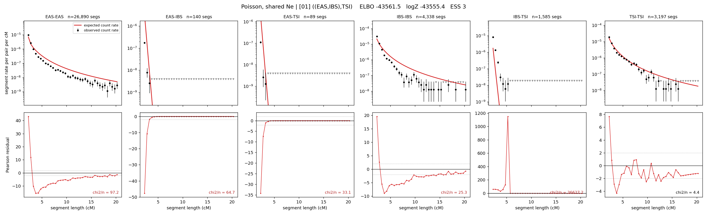

# `((EAS,IBS),TSI)`

**Poisson, shared Ne** | topology 01 of 21 | tree (no admixture) | 2 events, 5 nodes

## Model score

| quantity | value | |
|---|---|---|
| ELBO | -43561.51 | +- 0.20 (MC) |
| logZ (importance sampling) | -43555.45 | |
| ESS of the IS weights | 2.6 / 4000 | LOW -- treat logZ with suspicion |
| Stan dropped-constant correction | -12.13 | already applied |
| mode kept / MAP start / runtime | 1 / 11 | 7 s |
| mode search | 11/12 MAP starts succeeded | 3 distinct modes evaluated |

## Events (in temporal order, most recent first)

| # | type | detail | time (gen) | cumulative |
|---|---|---|---|---|
| 1 | MERGE | EAS + IBS -> n1 | 282.4 +- 1.3 | 282.4 |
| 2 | MERGE | n1 + TSI -> root | 7.8 +- 0.4 | 290.2 |

## Effective sizes shared by IBD and SNP (haploid)

| node | Ne | sd of log Ne |
|---|---|---|
| `EAS` | 1,200,337 | 0.01 |
| `IBS` | 243,584 | 0.02 |
| `TSI` | 327,934 | 0.02 |
| `n1` | 274 | 0.06 |
| `root` | 753 | 0.04 |

log-Ne random-walk step scale tau = 1.607

## Fit quality by component

| component | log-likelihood | n terms | chi2/n |
|---|---|---|---|
| IBD | -7,570.4 | 222 | 6176.30 |
| SNP | -35,900.5 | 6 | 11981.38 |

IBD chi2/n uses Poisson counting variance; SNP chi2/n uses its block SEs. Values near 1 indicate residuals on the modeled noise scale.

## SNP covariance residuals `(w_hat - W_pred)/w_se`

| | EAS | IBS | TSI |
|---|---|---|---|
| **EAS** | +112.55 | -124.32 | -98.04 |
| **IBS** | -124.32 | +93.06 | +154.03 |
| **TSI** | -98.04 | +154.03 | +42.03 |

