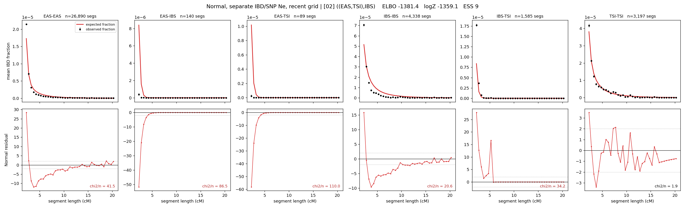

# `((EAS,TSI),IBS)`

**Normal, separate IBD/SNP Ne, recent grid** | topology 02 of 21 | tree (no admixture) | 2 events, 5 nodes

> Recent Ne grid: 0-5 and 5-10 generations. The first demographic event is explicitly constrained to occur after generation 10 (minimum 11 with the current one-generation gap).

## Model score

| quantity | value | |
|---|---|---|
| ELBO | -1381.45 | +- 0.37 (MC) |
| logZ (importance sampling) | -1359.07 | |
| ESS of the IS weights | 9.0 / 4000 | LOW -- treat logZ with suspicion |
| Stan dropped-constant correction | -26.08 | already applied |
| mode kept / MAP start / runtime | 1 / 0 | 17 s |
| mode search | 12/12 MAP starts succeeded | 3 distinct modes evaluated |

## Events (in temporal order, most recent first)

| # | type | detail | time (gen) | cumulative |
|---|---|---|---|---|
| 1 | MERGE | EAS + TSI -> n1 | 157.8 +- 0.5 | 157.8 |
| 2 | MERGE | n1 + IBS -> root | 3.6 +- 0.1 | 161.4 |

## Recent effective sizes for IBD (haploid)

| population | 0-5 gen | 5-10 gen |
|---|---:|---:|
| `EAS` | 31,059,471 | 18,898,605 |
| `IBS` | 3,445,292 | 2,166,388 |
| `TSI` | 1,960,647 | 1,334,833 |

## Effective sizes for IBD (haploid)

| node | Ne | sd of log Ne |
|---|---|---|
| `EAS` | 1,353,219 | 0.06 |
| `IBS` | 223,538 | 0.03 |
| `TSI` | 345,282 | 0.03 |
| `n1` | 18,835 | 0.03 |
| `root` | 32,090 | 0.03 |

log-Ne random-walk step scale tau_ibd = 2.329

## Recent effective sizes for SNP (haploid)

| population | 0-5 gen | 5-10 gen |
|---|---:|---:|
| `EAS` | 862 | 866 |
| `IBS` | 143,904 | 143,501 |
| `TSI` | 116,877 | 116,523 |

## Effective sizes for SNP (haploid)

| node | Ne | sd of log Ne |
|---|---|---|
| `EAS` | 876 | 0.01 |
| `IBS` | 142,696 | 0.04 |
| `TSI` | 115,814 | 0.03 |
| `n1` | 18,051 | 0.01 |
| `root` | 19,304 | 0.01 |

log-Ne random-walk step scale tau_snp = 1.029

## Fit quality by component

| component | log-likelihood | n terms | chi2/n |
|---|---|---|---|
| IBD | -1,201.9 | 222 | 49.30 |
| SNP | +41.0 | 6 | 0.86 |

IBD chi2/n uses Palamara model-derived Normal variance; SNP chi2/n uses its block SEs. Values near 1 indicate residuals on the modeled noise scale.

## SNP covariance residuals `(w_hat - W_pred)/w_se`

| | EAS | IBS | TSI |
|---|---|---|---|
| **EAS** | +0.01 | +0.04 | -0.05 |
| **IBS** | +0.04 | -0.05 | -0.03 |
| **TSI** | -0.05 | -0.03 | +0.12 |

