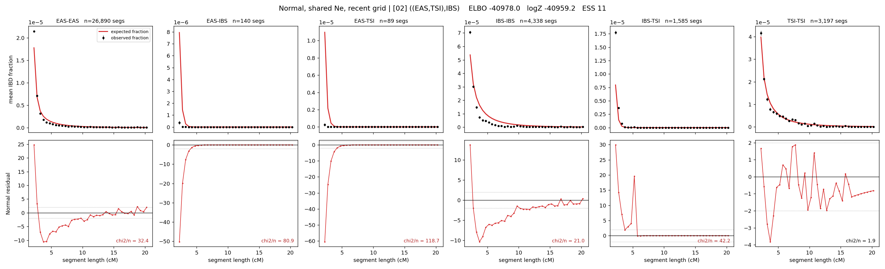

# `((EAS,TSI),IBS)`

**Normal, shared Ne, recent grid** | topology 02 of 21 | tree (no admixture) | 2 events, 5 nodes

> Recent Ne grid: 0-5 and 5-10 generations. The first demographic event is explicitly constrained to occur after generation 10 (minimum 11 with the current one-generation gap).

## Model score

| quantity | value | |
|---|---|---|
| ELBO | -40977.96 | +- 0.29 (MC) |
| logZ (importance sampling) | -40959.24 | |
| ESS of the IS weights | 11.2 / 4000 | LOW -- treat logZ with suspicion |
| Stan dropped-constant correction | -17.65 | already applied |
| mode kept / MAP start / runtime | 1 / 11 | 11 s |
| mode search | 12/12 MAP starts succeeded | 3 distinct modes evaluated |

## Events (in temporal order, most recent first)

| # | type | detail | time (gen) | cumulative |
|---|---|---|---|---|
| 1 | MERGE | EAS + TSI -> n1 | 162.3 +- 0.8 | 162.3 |
| 2 | MERGE | n1 + IBS -> root | 3.6 +- 0.1 | 165.9 |

## Recent effective sizes shared by IBD and SNP (haploid)

| population | 0-5 gen | 5-10 gen |
|---|---:|---:|
| `EAS` | 32,439,953 | 18,364,918 |
| `IBS` | 3,272,660 | 1,971,152 |
| `TSI` | 1,238,238 | 1,075,621 |

## Effective sizes shared by IBD and SNP (haploid)

| node | Ne | sd of log Ne |
|---|---|---|
| `EAS` | 1,419,417 | 0.04 |
| `IBS` | 211,634 | 0.04 |
| `TSI` | 335,485 | 0.06 |
| `n1` | 9,685 | 0.04 |
| `root` | 29,121 | 0.02 |

log-Ne random-walk step scale tau = 2.174

## Fit quality by component

| component | log-likelihood | n terms | chi2/n |
|---|---|---|---|
| IBD | -1,239.9 | 222 | 49.70 |
| SNP | -39,604.3 | 6 | 13215.98 |

IBD chi2/n uses Palamara model-derived Normal variance; SNP chi2/n uses its block SEs. Values near 1 indicate residuals on the modeled noise scale.

## SNP covariance residuals `(w_hat - W_pred)/w_se`

| | EAS | IBS | TSI |
|---|---|---|---|
| **EAS** | +117.34 | -115.18 | -116.75 |
| **IBS** | -115.18 | +110.88 | +116.27 |
| **TSI** | -116.75 | +116.27 | +113.23 |

