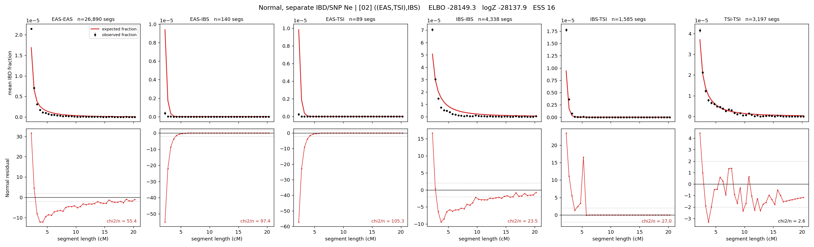

# `((EAS,TSI),IBS)`

**Normal, separate IBD/SNP Ne** | topology 02 of 21 | tree (no admixture) | 2 events, 5 nodes

## Model score

| quantity | value | |
|---|---|---|
| ELBO | -28149.27 | +- 0.17 (MC) |
| logZ (importance sampling) | -28137.91 | |
| ESS of the IS weights | 15.7 / 4000 | LOW -- treat logZ with suspicion |
| Stan dropped-constant correction | -15.06 | already applied |
| seed kept / runtime | 1 | 6 s |

## Events (in temporal order, most recent first)

| # | type | detail | time (gen) | cumulative |
|---|---|---|---|---|
| 1 | MERGE | EAS + TSI -> n1 | 162.0 +- 0.4 | 162.0 |
| 2 | MERGE | n1 + IBS -> root | 1.1 +- 0.1 | 163.1 |

## Effective sizes for IBD (haploid)

| node | Ne | sd of log Ne |
|---|---|---|
| `EAS` | 1,387,693 | 0.02 |
| `IBS` | 235,883 | 0.03 |
| `TSI` | 357,407 | 0.03 |
| `n1` | 21,375 | 0.02 |
| `root` | 27,052 | 0.01 |

log-Ne random-walk step scale tau_ibd = 0.845

## Effective sizes for SNP (haploid)

| node | Ne | sd of log Ne |
|---|---|---|
| `EAS` | 5,740 | 0.01 |
| `IBS` | 5,740 | 0.01 |
| `TSI` | 5,740 | 0.01 |
| `n1` | 5,740 | 0.01 |
| `root` | 5,740 | 0.01 |

log-Ne random-walk step scale tau_snp = 0.000

## Fit quality by component

| component | log-likelihood | n terms | chi2/n |
|---|---|---|---|
| IBD | -1,511.5 | 222 | 51.91 |
| SNP | -26,514.7 | 6 | 8852.77 |

IBD chi2/n uses Palamara model-derived Normal variance; SNP chi2/n uses its block SEs. Values near 1 indicate residuals on the modeled noise scale.

## SNP covariance residuals `(w_hat - W_pred)/w_se`

| | EAS | IBS | TSI |
|---|---|---|---|
| **EAS** | +90.09 | -88.47 | -89.60 |
| **IBS** | -88.47 | +9.82 | +170.08 |
| **TSI** | -89.60 | +170.08 | +10.86 |

