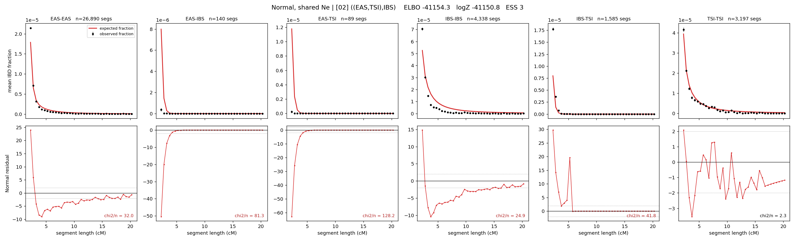

# `((EAS,TSI),IBS)`

**Normal, shared Ne** | topology 02 of 21 | tree (no admixture) | 2 events, 5 nodes

## Model score

| quantity | value | |
|---|---|---|
| ELBO | -41154.27 | +- 0.03 (MC) |
| logZ (importance sampling) | -41150.83 | |
| ESS of the IS weights | 3.2 / 4000 | LOW -- treat logZ with suspicion |
| Stan dropped-constant correction | -12.13 | already applied |
| seed kept / runtime | 7 | 4 s |

## Events (in temporal order, most recent first)

| # | type | detail | time (gen) | cumulative |
|---|---|---|---|---|
| 1 | MERGE | EAS + TSI -> n1 | 161.6 +- 1.0 | 161.6 |
| 2 | MERGE | n1 + IBS -> root | 4.4 +- 0.5 | 166.0 |

## Effective sizes shared by IBD and SNP (haploid)

| node | Ne | sd of log Ne |
|---|---|---|
| `EAS` | 1,597,417 | 0.02 |
| `IBS` | 219,067 | 0.02 |
| `TSI` | 351,938 | 0.03 |
| `n1` | 9,544 | 0.14 |
| `root` | 28,931 | 0.02 |

log-Ne random-walk step scale tau = 1.488

## Fit quality by component

| component | log-likelihood | n terms | chi2/n |
|---|---|---|---|
| IBD | -1,493.5 | 222 | 51.78 |
| SNP | -39,583.1 | 6 | 13208.90 |

IBD chi2/n uses Palamara model-derived Normal variance; SNP chi2/n uses its block SEs. Values near 1 indicate residuals on the modeled noise scale.

## SNP covariance residuals `(w_hat - W_pred)/w_se`

| | EAS | IBS | TSI |
|---|---|---|---|
| **EAS** | +117.32 | -115.11 | -116.79 |
| **IBS** | -115.11 | +110.63 | +116.40 |
| **TSI** | -116.79 | +116.40 | +113.18 |

