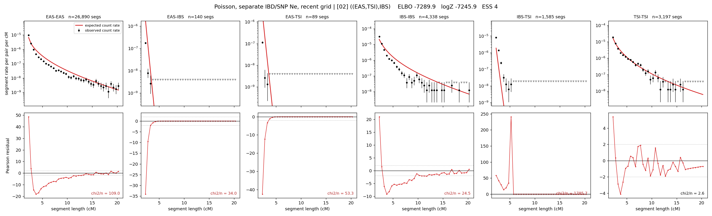

# `((EAS,TSI),IBS)`

**Poisson, separate IBD/SNP Ne, recent grid** | topology 02 of 21 | tree (no admixture) | 2 events, 5 nodes

> Recent Ne grid: 0-5 and 5-10 generations. The first demographic event is explicitly constrained to occur after generation 10 (minimum 11 with the current one-generation gap).

## Model score

| quantity | value | |
|---|---|---|
| ELBO | -7289.86 | +- 0.51 (MC) |
| logZ (importance sampling) | -7245.89 | |
| ESS of the IS weights | 3.7 / 4000 | LOW -- treat logZ with suspicion |
| Stan dropped-constant correction | -26.08 | already applied |
| mode kept / MAP start / runtime | 1 / 2 | 16 s |
| mode search | 12/12 MAP starts succeeded | 3 distinct modes evaluated |

## Events (in temporal order, most recent first)

| # | type | detail | time (gen) | cumulative |
|---|---|---|---|---|
| 1 | MERGE | EAS + TSI -> n1 | 232.4 +- 1.8 | 232.4 |
| 2 | MERGE | n1 + IBS -> root | 6.2 +- 0.3 | 238.6 |

## Recent effective sizes for IBD (haploid)

| population | 0-5 gen | 5-10 gen |
|---|---:|---:|
| `EAS` | 54,702,641 | 30,907,563 |
| `IBS` | 6,582,915 | 3,846,599 |
| `TSI` | 3,421,932 | 2,067,355 |

## Effective sizes for IBD (haploid)

| node | Ne | sd of log Ne |
|---|---|---|
| `EAS` | 1,059,988 | 0.03 |
| `IBS` | 230,002 | 0.03 |
| `TSI` | 322,945 | 0.06 |
| `n1` | 2,887 | 0.08 |
| `root` | 4,689 | 0.04 |

log-Ne random-walk step scale tau_ibd = 2.513

## Recent effective sizes for SNP (haploid)

| population | 0-5 gen | 5-10 gen |
|---|---:|---:|
| `EAS` | 1,105 | 1,103 |
| `IBS` | 171,156 | 198,126 |
| `TSI` | 138,221 | 134,276 |

## Effective sizes for SNP (haploid)

| node | Ne | sd of log Ne |
|---|---|---|
| `EAS` | 1,298 | 0.02 |
| `IBS` | 210,907 | 0.20 |
| `TSI` | 161,716 | 0.14 |
| `n1` | 21,540 | 0.02 |
| `root` | 22,251 | 0.02 |

log-Ne random-walk step scale tau_snp = 0.916

## Fit quality by component

| component | log-likelihood | n terms | chi2/n |
|---|---|---|---|
| IBD | -7,072.8 | 222 | 340.46 |
| SNP | +30.7 | 6 | 4.32 |

IBD chi2/n uses Poisson counting variance; SNP chi2/n uses its block SEs. Values near 1 indicate residuals on the modeled noise scale.

## SNP covariance residuals `(w_hat - W_pred)/w_se`

| | EAS | IBS | TSI |
|---|---|---|---|
| **EAS** | -0.05 | +0.11 | -0.01 |
| **IBS** | +0.11 | -0.49 | +0.29 |
| **TSI** | -0.01 | +0.29 | -0.26 |

