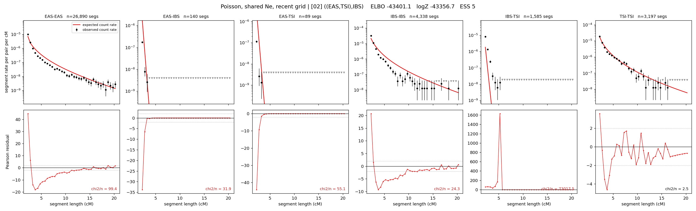

# `((EAS,TSI),IBS)`

**Poisson, shared Ne, recent grid** | topology 02 of 21 | tree (no admixture) | 2 events, 5 nodes

> Recent Ne grid: 0-5 and 5-10 generations. The first demographic event is explicitly constrained to occur after generation 10 (minimum 11 with the current one-generation gap).

## Model score

| quantity | value | |
|---|---|---|
| ELBO | -43401.12 | +- 0.92 (MC) |
| logZ (importance sampling) | -43356.67 | |
| ESS of the IS weights | 5.4 / 4000 | LOW -- treat logZ with suspicion |
| Stan dropped-constant correction | -17.65 | already applied |
| mode kept / MAP start / runtime | 1 / 9 | 15 s |
| mode search | 12/12 MAP starts succeeded | 3 distinct modes evaluated |

## Events (in temporal order, most recent first)

| # | type | detail | time (gen) | cumulative |
|---|---|---|---|---|
| 1 | MERGE | EAS + TSI -> n1 | 295.0 +- 0.5 | 295.0 |
| 2 | MERGE | n1 + IBS -> root | 7.7 +- 0.2 | 302.7 |

## Recent effective sizes shared by IBD and SNP (haploid)

| population | 0-5 gen | 5-10 gen |
|---|---:|---:|
| `EAS` | 145,986,746 | 64,313,696 |
| `IBS` | 15,118,135 | 6,800,547 |
| `TSI` | 3,965,859 | 2,523,905 |

## Effective sizes shared by IBD and SNP (haploid)

| node | Ne | sd of log Ne |
|---|---|---|
| `EAS` | 1,059,397 | 0.03 |
| `IBS` | 229,529 | 0.08 |
| `TSI` | 309,430 | 0.04 |
| `n1` | 277 | 0.05 |
| `root` | 448 | 0.02 |

log-Ne random-walk step scale tau = 2.581

## Fit quality by component

| component | log-likelihood | n terms | chi2/n |
|---|---|---|---|
| IBD | -7,146.0 | 222 | 12239.84 |
| SNP | -36,045.8 | 6 | 12029.79 |

IBD chi2/n uses Poisson counting variance; SNP chi2/n uses its block SEs. Values near 1 indicate residuals on the modeled noise scale.

## SNP covariance residuals `(w_hat - W_pred)/w_se`

| | EAS | IBS | TSI |
|---|---|---|---|
| **EAS** | +112.61 | -97.30 | -125.37 |
| **IBS** | -97.30 | +42.24 | +153.34 |
| **TSI** | -125.37 | +153.34 | +94.79 |

