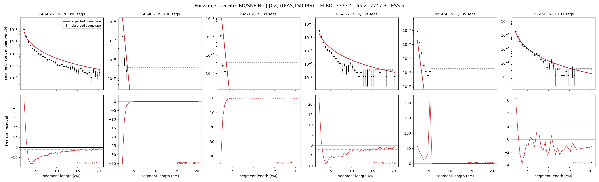

# `((EAS,TSI),IBS)`

**Poisson, separate IBD/SNP Ne** | topology 02 of 21 | tree (no admixture) | 2 events, 5 nodes

## Model score

| quantity | value | |
|---|---|---|
| ELBO | -7773.38 | +- 0.47 (MC) |
| logZ (importance sampling) | -7747.35 | |
| ESS of the IS weights | 6.1 / 4000 | LOW -- treat logZ with suspicion |
| Stan dropped-constant correction | -15.06 | already applied |
| seed kept / runtime | 7 | 9 s |

## Events (in temporal order, most recent first)

| # | type | detail | time (gen) | cumulative |
|---|---|---|---|---|
| 1 | MERGE | EAS + TSI -> n1 | 234.6 +- 0.6 | 234.6 |
| 2 | MERGE | n1 + IBS -> root | 1.0 +- 0.0 | 235.6 |

## Effective sizes for IBD (haploid)

| node | Ne | sd of log Ne |
|---|---|---|
| `EAS` | 1,177,362 | 0.04 |
| `IBS` | 243,640 | 0.03 |
| `TSI` | 342,868 | 0.04 |
| `n1` | 367 | 0.02 |
| `root` | 4,958 | 0.02 |

log-Ne random-walk step scale tau_ibd = 2.965

## Effective sizes for SNP (haploid)

| node | Ne | sd of log Ne |
|---|---|---|
| `EAS` | 1,301 | 0.01 |
| `IBS` | 170,953 | 0.18 |
| `TSI` | 162,905 | 0.29 |
| `n1` | 31,496 | 0.01 |
| `root` | 33,928 | 0.00 |

log-Ne random-walk step scale tau_snp = 0.975

## Fit quality by component

| component | log-likelihood | n terms | chi2/n |
|---|---|---|---|
| IBD | -7,601.0 | 222 | 283.05 |
| SNP | +34.0 | 6 | 3.22 |

IBD chi2/n uses Poisson counting variance; SNP chi2/n uses its block SEs. Values near 1 indicate residuals on the modeled noise scale.

## SNP covariance residuals `(w_hat - W_pred)/w_se`

| | EAS | IBS | TSI |
|---|---|---|---|
| **EAS** | +0.01 | +0.01 | -0.02 |
| **IBS** | +0.01 | -0.43 | +0.45 |
| **TSI** | -0.02 | +0.45 | -0.40 |

