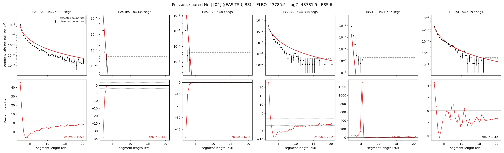

# `((EAS,TSI),IBS)`

**Poisson, shared Ne** | topology 02 of 21 | tree (no admixture) | 2 events, 5 nodes

## Model score

| quantity | value | |
|---|---|---|
| ELBO | -43785.49 | +- 0.06 (MC) |
| logZ (importance sampling) | -43781.45 | |
| ESS of the IS weights | 6.1 / 4000 | LOW -- treat logZ with suspicion |
| Stan dropped-constant correction | -12.13 | already applied |
| mode kept / MAP start / runtime | 1 / 7 | 7 s |
| mode search | 12/12 MAP starts succeeded | 3 distinct modes evaluated |

## Events (in temporal order, most recent first)

| # | type | detail | time (gen) | cumulative |
|---|---|---|---|---|
| 1 | MERGE | EAS + TSI -> n1 | 288.0 +- 1.4 | 288.0 |
| 2 | MERGE | n1 + IBS -> root | 7.5 +- 0.6 | 295.5 |

## Effective sizes shared by IBD and SNP (haploid)

| node | Ne | sd of log Ne |
|---|---|---|
| `EAS` | 1,175,876 | 0.01 |
| `IBS` | 241,841 | 0.02 |
| `TSI` | 328,874 | 0.02 |
| `n1` | 269 | 0.08 |
| `root` | 576 | 0.06 |

log-Ne random-walk step scale tau = 1.567

## Fit quality by component

| component | log-likelihood | n terms | chi2/n |
|---|---|---|---|
| IBD | -7,647.5 | 222 | 7882.06 |
| SNP | -36,047.7 | 6 | 12030.42 |

IBD chi2/n uses Poisson counting variance; SNP chi2/n uses its block SEs. Values near 1 indicate residuals on the modeled noise scale.

## SNP covariance residuals `(w_hat - W_pred)/w_se`

| | EAS | IBS | TSI |
|---|---|---|---|
| **EAS** | +112.63 | -97.32 | -125.41 |
| **IBS** | -97.32 | +42.34 | +153.27 |
| **TSI** | -125.41 | +153.27 | +94.94 |

