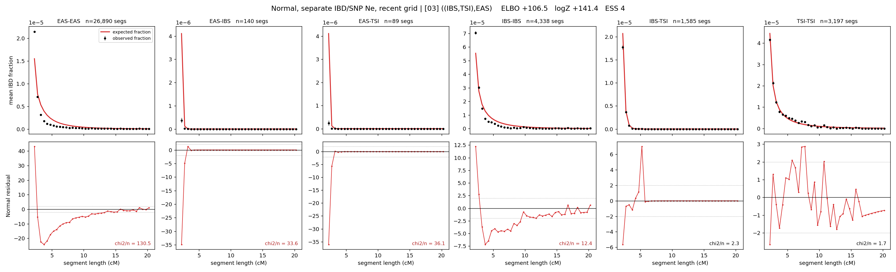

# `((IBS,TSI),EAS)`

**Normal, separate IBD/SNP Ne, recent grid** | topology 03 of 21 | tree (no admixture) | 2 events, 5 nodes

> Recent Ne grid: 0-5 and 5-10 generations. The first demographic event is explicitly constrained to occur after generation 10 (minimum 11 with the current one-generation gap).

## Model score

| quantity | value | |
|---|---|---|
| ELBO | +106.55 | +- 0.46 (MC) |
| logZ (importance sampling) | +141.42 | |
| ESS of the IS weights | 3.7 / 4000 | LOW -- treat logZ with suspicion |
| Stan dropped-constant correction | -26.08 | already applied |
| mode kept / MAP start / runtime | 1 / 7 | 17 s |
| mode search | 12/12 MAP starts succeeded | 3 distinct modes evaluated |

## Events (in temporal order, most recent first)

| # | type | detail | time (gen) | cumulative |
|---|---|---|---|---|
| 1 | MERGE | IBS + TSI -> n1 | 144.7 +- 1.2 | 144.7 |
| 2 | MERGE | EAS + n1 -> root | 214.7 +- 0.5 | 359.4 |

## Recent effective sizes for IBD (haploid)

| population | 0-5 gen | 5-10 gen |
|---|---:|---:|
| `EAS` | 48,544,908 | 28,249,976 |
| `IBS` | 4,080,394 | 2,404,776 |
| `TSI` | 1,946,255 | 1,263,243 |

## Effective sizes for IBD (haploid)

| node | Ne | sd of log Ne |
|---|---|---|
| `EAS` | 870,462 | 0.02 |
| `IBS` | 272,970 | 0.06 |
| `TSI` | 398,465 | 0.06 |
| `n1` | 27,836 | 0.03 |
| `root` | 29 | 0.03 |

log-Ne random-walk step scale tau_ibd = 2.557

## Recent effective sizes for SNP (haploid)

| population | 0-5 gen | 5-10 gen |
|---|---:|---:|
| `EAS` | 1,988 | 2,016 |
| `IBS` | 109,647 | 108,170 |
| `TSI` | 97,076 | 96,540 |

## Effective sizes for SNP (haploid)

| node | Ne | sd of log Ne |
|---|---|---|
| `EAS` | 2,047 | 0.01 |
| `IBS` | 105,356 | 0.03 |
| `TSI` | 97,735 | 0.03 |
| `n1` | 45,780 | 0.02 |
| `root` | 11,405 | 0.01 |

log-Ne random-walk step scale tau_snp = 0.577

## Fit quality by component

| component | log-likelihood | n terms | chi2/n |
|---|---|---|---|
| IBD | +340.0 | 222 | 36.25 |
| SNP | +37.7 | 6 | 1.99 |

IBD chi2/n uses Palamara model-derived Normal variance; SNP chi2/n uses its block SEs. Values near 1 indicate residuals on the modeled noise scale.

## SNP covariance residuals `(w_hat - W_pred)/w_se`

| | EAS | IBS | TSI |
|---|---|---|---|
| **EAS** | +0.01 | +0.00 | -0.01 |
| **IBS** | +0.00 | -0.20 | +0.21 |
| **TSI** | -0.01 | +0.21 | -0.17 |

