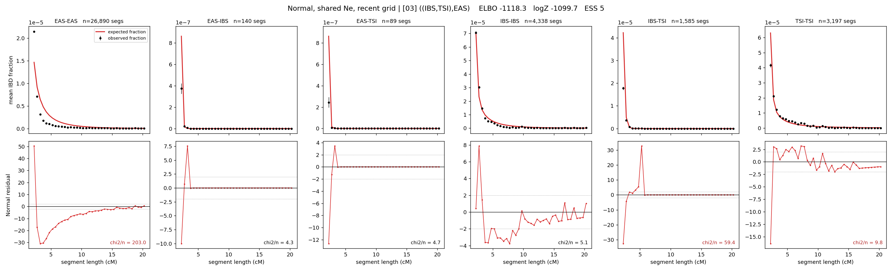

# `((IBS,TSI),EAS)`

**Normal, shared Ne, recent grid** | topology 03 of 21 | tree (no admixture) | 2 events, 5 nodes

> Recent Ne grid: 0-5 and 5-10 generations. The first demographic event is explicitly constrained to occur after generation 10 (minimum 11 with the current one-generation gap).

## Model score

| quantity | value | |
|---|---|---|
| ELBO | -1118.29 | +- 0.29 (MC) |
| logZ (importance sampling) | -1099.72 | |
| ESS of the IS weights | 4.9 / 4000 | LOW -- treat logZ with suspicion |
| Stan dropped-constant correction | -17.65 | already applied |
| seed kept / runtime | 7 | 15 s |

## Events (in temporal order, most recent first)

| # | type | detail | time (gen) | cumulative |
|---|---|---|---|---|
| 1 | MERGE | IBS + TSI -> n1 | 211.1 +- 0.6 | 211.1 |
| 2 | MERGE | EAS + n1 -> root | 207.9 +- 1.2 | 419.0 |

## Recent effective sizes shared by IBD and SNP (haploid)

| population | 0-5 gen | 5-10 gen |
|---|---:|---:|
| `EAS` | 31,554,809 | 17,244,719 |
| `IBS` | 8,592,302 | 4,690,417 |
| `TSI` | 626,269 | 466,533 |

## Effective sizes shared by IBD and SNP (haploid)

| node | Ne | sd of log Ne |
|---|---|---|
| `EAS` | 718,711 | 0.02 |
| `IBS` | 357,604 | 0.06 |
| `TSI` | 477,676 | 0.03 |
| `n1` | 1,166 | 0.01 |
| `root` | 2 | 0.01 |

log-Ne random-walk step scale tau = 3.361

## Fit quality by component

| component | log-likelihood | n terms | chi2/n |
|---|---|---|---|
| IBD | -889.4 | 222 | 47.80 |
| SNP | +20.8 | 6 | 7.61 |

IBD chi2/n uses Palamara model-derived Normal variance; SNP chi2/n uses its block SEs. Values near 1 indicate residuals on the modeled noise scale.

## SNP covariance residuals `(w_hat - W_pred)/w_se`

| | EAS | IBS | TSI |
|---|---|---|---|
| **EAS** | +1.27 | -1.13 | -1.38 |
| **IBS** | -1.13 | +3.30 | -1.23 |
| **TSI** | -1.38 | -1.23 | +3.80 |

