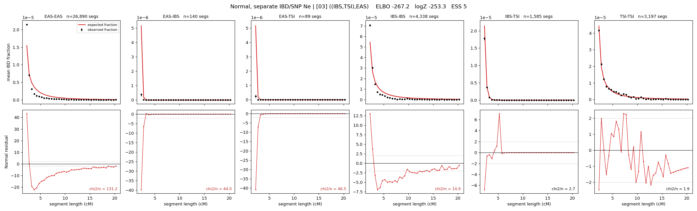

# `((IBS,TSI),EAS)`

**Normal, separate IBD/SNP Ne** | topology 03 of 21 | tree (no admixture) | 2 events, 5 nodes

## Model score

| quantity | value | |
|---|---|---|
| ELBO | -267.23 | +- 0.21 (MC) |
| logZ (importance sampling) | -253.27 | |
| ESS of the IS weights | 5.3 / 4000 | LOW -- treat logZ with suspicion |
| Stan dropped-constant correction | -15.06 | already applied |
| mode kept / MAP start / runtime | 1 / 2 | 12 s |
| mode search | 12/12 MAP starts succeeded | 3 distinct modes evaluated |

## Events (in temporal order, most recent first)

| # | type | detail | time (gen) | cumulative |
|---|---|---|---|---|
| 1 | MERGE | IBS + TSI -> n1 | 144.7 +- 0.5 | 144.7 |
| 2 | MERGE | EAS + n1 -> root | 187.8 +- 0.5 | 332.5 |

## Effective sizes for IBD (haploid)

| node | Ne | sd of log Ne |
|---|---|---|
| `EAS` | 969,230 | 0.03 |
| `IBS` | 287,900 | 0.03 |
| `TSI` | 415,764 | 0.02 |
| `n1` | 28,401 | 0.01 |
| `root` | 93 | 0.02 |

log-Ne random-walk step scale tau_ibd = 0.952

## Effective sizes for SNP (haploid)

| node | Ne | sd of log Ne |
|---|---|---|
| `EAS` | 1,873 | 0.01 |
| `IBS` | 144,573 | 0.01 |
| `TSI` | 107,301 | 0.01 |
| `n1` | 60,924 | 0.01 |
| `root` | 15,401 | 0.00 |

log-Ne random-walk step scale tau_snp = 0.498

## Fit quality by component

| component | log-likelihood | n terms | chi2/n |
|---|---|---|---|
| IBD | -134.1 | 222 | 40.25 |
| SNP | +38.3 | 6 | 1.78 |

IBD chi2/n uses Palamara model-derived Normal variance; SNP chi2/n uses its block SEs. Values near 1 indicate residuals on the modeled noise scale.

## SNP covariance residuals `(w_hat - W_pred)/w_se`

| | EAS | IBS | TSI |
|---|---|---|---|
| **EAS** | -0.09 | -0.02 | +0.19 |
| **IBS** | -0.02 | +0.62 | -0.62 |
| **TSI** | +0.19 | -0.62 | +0.22 |

