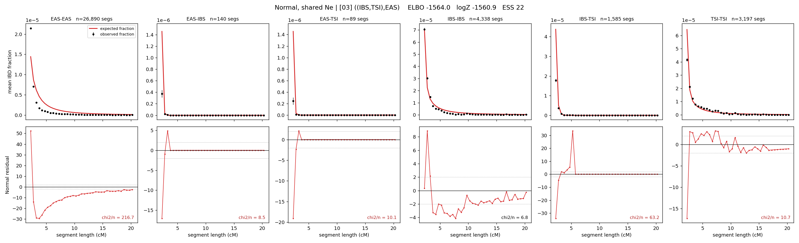

# `((IBS,TSI),EAS)`

**Normal, shared Ne** | topology 03 of 21 | tree (no admixture) | 2 events, 5 nodes

## Model score

| quantity | value | |
|---|---|---|
| ELBO | -1564.02 | +- 0.07 (MC) |
| logZ (importance sampling) | -1560.88 | |
| ESS of the IS weights | 21.9 / 4000 | LOW -- treat logZ with suspicion |
| Stan dropped-constant correction | -12.13 | already applied |
| seed kept / runtime | 1 | 10 s |

## Events (in temporal order, most recent first)

| # | type | detail | time (gen) | cumulative |
|---|---|---|---|---|
| 1 | MERGE | IBS + TSI -> n1 | 212.2 +- 0.5 | 212.2 |
| 2 | MERGE | EAS + n1 -> root | 194.4 +- 3.6 | 406.7 |

## Effective sizes shared by IBD and SNP (haploid)

| node | Ne | sd of log Ne |
|---|---|---|
| `EAS` | 770,438 | 0.01 |
| `IBS` | 380,339 | 0.02 |
| `TSI` | 480,974 | 0.02 |
| `n1` | 1,092 | 0.02 |
| `root` | 0 | 0.51 |

log-Ne random-walk step scale tau = 1.705

## Fit quality by component

| component | log-likelihood | n terms | chi2/n |
|---|---|---|---|
| IBD | -1,456.4 | 222 | 52.70 |
| SNP | +24.9 | 6 | 6.24 |

IBD chi2/n uses Palamara model-derived Normal variance; SNP chi2/n uses its block SEs. Values near 1 indicate residuals on the modeled noise scale.

## SNP covariance residuals `(w_hat - W_pred)/w_se`

| | EAS | IBS | TSI |
|---|---|---|---|
| **EAS** | +1.44 | -1.30 | -1.55 |
| **IBS** | -1.30 | +3.48 | -1.07 |
| **TSI** | -1.55 | -1.07 | +3.96 |

