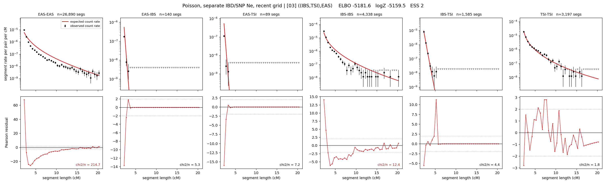

# `((IBS,TSI),EAS)`

**Poisson, separate IBD/SNP Ne, recent grid** | topology 03 of 21 | tree (no admixture) | 2 events, 5 nodes

> Recent Ne grid: 0-5 and 5-10 generations. The first demographic event is explicitly constrained to occur after generation 10 (minimum 11 with the current one-generation gap).

## Model score

| quantity | value | |
|---|---|---|
| ELBO | -5181.60 | +- 0.28 (MC) |
| logZ (importance sampling) | -5159.55 | |
| ESS of the IS weights | 2.4 / 4000 | LOW -- treat logZ with suspicion |
| Stan dropped-constant correction | -26.08 | already applied |
| mode kept / MAP start / runtime | 1 / 7 | 16 s |
| mode search | 12/12 MAP starts succeeded | 3 distinct modes evaluated |

## Events (in temporal order, most recent first)

| # | type | detail | time (gen) | cumulative |
|---|---|---|---|---|
| 1 | MERGE | IBS + TSI -> n1 | 162.4 +- 0.7 | 162.4 |
| 2 | MERGE | EAS + n1 -> root | 142.6 +- 0.3 | 305.0 |

## Recent effective sizes for IBD (haploid)

| population | 0-5 gen | 5-10 gen |
|---|---:|---:|
| `EAS` | 58,289,700 | 34,479,635 |
| `IBS` | 4,418,751 | 2,735,374 |
| `TSI` | 1,506,689 | 883,688 |

## Effective sizes for IBD (haploid)

| node | Ne | sd of log Ne |
|---|---|---|
| `EAS` | 831,111 | 0.02 |
| `IBS` | 294,041 | 0.04 |
| `TSI` | 405,871 | 0.06 |
| `n1` | 13,233 | 0.02 |
| `root` | 1,453 | 0.01 |

log-Ne random-walk step scale tau_ibd = 2.480

## Recent effective sizes for SNP (haploid)

| population | 0-5 gen | 5-10 gen |
|---|---:|---:|
| `EAS` | 1,721 | 1,685 |
| `IBS` | 117,695 | 117,109 |
| `TSI` | 121,230 | 114,568 |

## Effective sizes for SNP (haploid)

| node | Ne | sd of log Ne |
|---|---|---|
| `EAS` | 1,726 | 0.01 |
| `IBS` | 116,081 | 0.02 |
| `TSI` | 116,550 | 0.02 |
| `n1` | 40,942 | 0.01 |
| `root` | 13,907 | 0.01 |

log-Ne random-walk step scale tau_snp = 0.723

## Fit quality by component

| component | log-likelihood | n terms | chi2/n |
|---|---|---|---|
| IBD | -4,964.2 | 222 | 41.07 |
| SNP | +35.0 | 6 | 2.87 |

IBD chi2/n uses Poisson counting variance; SNP chi2/n uses its block SEs. Values near 1 indicate residuals on the modeled noise scale.

## SNP covariance residuals `(w_hat - W_pred)/w_se`

| | EAS | IBS | TSI |
|---|---|---|---|
| **EAS** | +0.02 | +0.05 | -0.08 |
| **IBS** | +0.05 | -0.21 | +0.13 |
| **TSI** | -0.08 | +0.13 | +0.03 |

