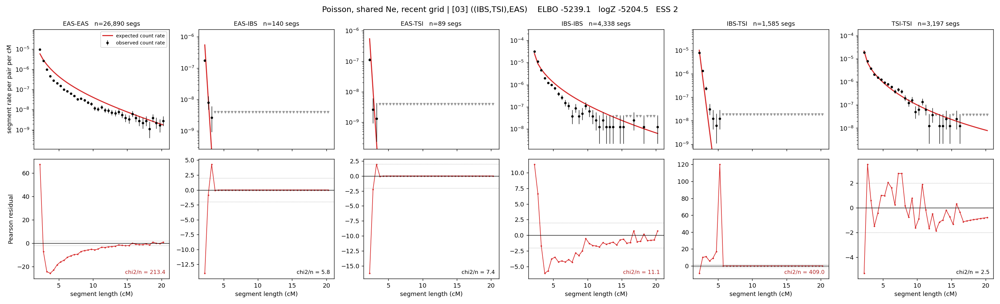

# `((IBS,TSI),EAS)`

**Poisson, shared Ne, recent grid** | topology 03 of 21 | tree (no admixture) | 2 events, 5 nodes

> Recent Ne grid: 0-5 and 5-10 generations. The first demographic event is explicitly constrained to occur after generation 10 (minimum 11 with the current one-generation gap).

## Model score

| quantity | value | |
|---|---|---|
| ELBO | -5239.15 | +- 0.60 (MC) |
| logZ (importance sampling) | -5204.55 | |
| ESS of the IS weights | 1.8 / 4000 | LOW -- treat logZ with suspicion |
| Stan dropped-constant correction | -17.65 | already applied |
| mode kept / MAP start / runtime | 2 / 11 | 17 s |
| mode search | 12/12 MAP starts succeeded | 3 distinct modes evaluated |

## Events (in temporal order, most recent first)

| # | type | detail | time (gen) | cumulative |
|---|---|---|---|---|
| 1 | MERGE | IBS + TSI -> n1 | 243.9 +- 1.8 | 243.9 |
| 2 | MERGE | EAS + n1 -> root | 126.2 +- 0.5 | 370.0 |

## Recent effective sizes shared by IBD and SNP (haploid)

| population | 0-5 gen | 5-10 gen |
|---|---:|---:|
| `EAS` | 91,849,822 | 46,454,734 |
| `IBS` | 4,486,081 | 2,583,272 |
| `TSI` | 1,130,785 | 1,040,692 |

## Effective sizes shared by IBD and SNP (haploid)

| node | Ne | sd of log Ne |
|---|---|---|
| `EAS` | 830,960 | 0.02 |
| `IBS` | 292,864 | 0.05 |
| `TSI` | 399,244 | 0.06 |
| `n1` | 699 | 0.02 |
| `root` | 105 | 0.02 |

log-Ne random-walk step scale tau = 2.818

## Fit quality by component

| component | log-likelihood | n terms | chi2/n |
|---|---|---|---|
| IBD | -5,075.2 | 222 | 110.61 |
| SNP | +24.0 | 6 | 6.53 |

IBD chi2/n uses Poisson counting variance; SNP chi2/n uses its block SEs. Values near 1 indicate residuals on the modeled noise scale.

## SNP covariance residuals `(w_hat - W_pred)/w_se`

| | EAS | IBS | TSI |
|---|---|---|---|
| **EAS** | -0.18 | +0.33 | +0.01 |
| **IBS** | +0.33 | +1.33 | -2.11 |
| **TSI** | +0.01 | -2.11 | +1.96 |

