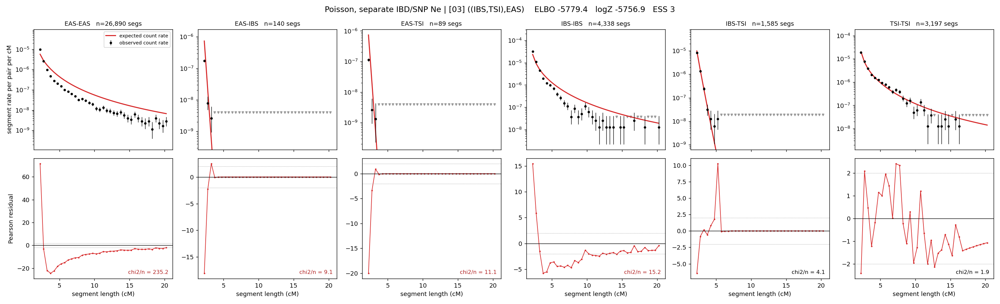

# `((IBS,TSI),EAS)`

**Poisson, separate IBD/SNP Ne** | topology 03 of 21 | tree (no admixture) | 2 events, 5 nodes

## Model score

| quantity | value | |
|---|---|---|
| ELBO | -5779.43 | +- 0.40 (MC) |
| logZ (importance sampling) | -5756.87 | |
| ESS of the IS weights | 2.8 / 4000 | LOW -- treat logZ with suspicion |
| Stan dropped-constant correction | -15.06 | already applied |
| mode kept / MAP start / runtime | 1 / 11 | 10 s |
| mode search | 12/12 MAP starts succeeded | 3 distinct modes evaluated |

## Events (in temporal order, most recent first)

| # | type | detail | time (gen) | cumulative |
|---|---|---|---|---|
| 1 | MERGE | IBS + TSI -> n1 | 159.3 +- 0.9 | 159.3 |
| 2 | MERGE | EAS + n1 -> root | 181.3 +- 0.5 | 340.7 |

## Effective sizes for IBD (haploid)

| node | Ne | sd of log Ne |
|---|---|---|
| `EAS` | 899,144 | 0.02 |
| `IBS` | 314,986 | 0.06 |
| `TSI` | 423,925 | 0.04 |
| `n1` | 14,638 | 0.02 |
| `root` | 266 | 0.02 |

log-Ne random-walk step scale tau_ibd = 1.427

## Effective sizes for SNP (haploid)

| node | Ne | sd of log Ne |
|---|---|---|
| `EAS` | 1,920 | 0.01 |
| `IBS` | 124,215 | 0.02 |
| `TSI` | 104,606 | 0.02 |
| `n1` | 61,027 | 0.01 |
| `root` | 15,746 | 0.00 |

log-Ne random-walk step scale tau_snp = 0.750

## Fit quality by component

| component | log-likelihood | n terms | chi2/n |
|---|---|---|---|
| IBD | -5,677.1 | 222 | 46.29 |
| SNP | +39.2 | 6 | 1.47 |

IBD chi2/n uses Poisson counting variance; SNP chi2/n uses its block SEs. Values near 1 indicate residuals on the modeled noise scale.

## SNP covariance residuals `(w_hat - W_pred)/w_se`

| | EAS | IBS | TSI |
|---|---|---|---|
| **EAS** | -0.01 | -0.05 | +0.06 |
| **IBS** | -0.05 | -0.03 | +0.13 |
| **TSI** | +0.06 | +0.13 | -0.24 |

