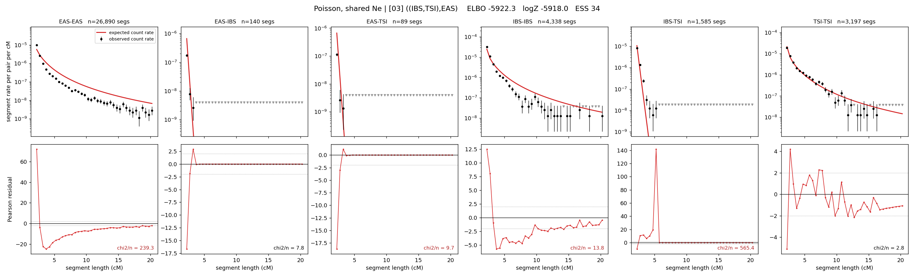

# `((IBS,TSI),EAS)`

**Poisson, shared Ne** | topology 03 of 21 | tree (no admixture) | 2 events, 5 nodes

## Model score

| quantity | value | |
|---|---|---|
| ELBO | -5922.32 | +- 0.13 (MC) |
| logZ (importance sampling) | -5918.00 | |
| ESS of the IS weights | 34.4 / 4000 | LOW -- treat logZ with suspicion |
| Stan dropped-constant correction | -12.13 | already applied |
| seed kept / runtime | 13 | 9 s |

## Events (in temporal order, most recent first)

| # | type | detail | time (gen) | cumulative |
|---|---|---|---|---|
| 1 | MERGE | IBS + TSI -> n1 | 249.8 +- 0.8 | 249.8 |
| 2 | MERGE | EAS + n1 -> root | 97.5 +- 2.8 | 347.3 |

## Effective sizes shared by IBD and SNP (haploid)

| node | Ne | sd of log Ne |
|---|---|---|
| `EAS` | 890,180 | 0.01 |
| `IBS` | 311,967 | 0.01 |
| `TSI` | 413,999 | 0.02 |
| `n1` | 541 | 0.03 |
| `root` | 227 | 0.11 |

log-Ne random-walk step scale tau = 1.302

## Fit quality by component

| component | log-likelihood | n terms | chi2/n |
|---|---|---|---|
| IBD | -5,790.9 | 222 | 140.13 |
| SNP | +36.7 | 6 | 2.32 |

IBD chi2/n uses Poisson counting variance; SNP chi2/n uses its block SEs. Values near 1 indicate residuals on the modeled noise scale.

## SNP covariance residuals `(w_hat - W_pred)/w_se`

| | EAS | IBS | TSI |
|---|---|---|---|
| **EAS** | +0.09 | +0.07 | -0.25 |
| **IBS** | +0.07 | +1.58 | -1.83 |
| **TSI** | -0.25 | -1.83 | +2.20 |

