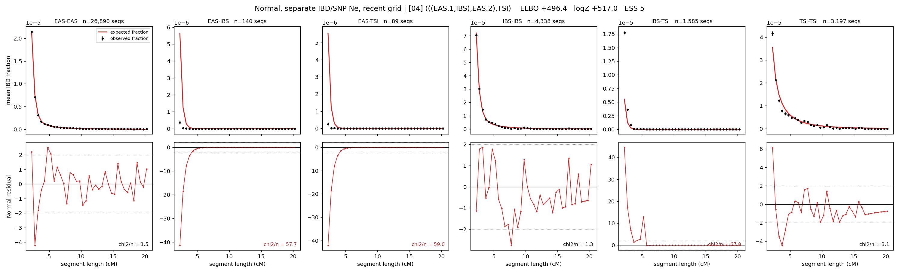

# `(((EAS.1,IBS),EAS.2),TSI)`

**Normal, separate IBD/SNP Ne, recent grid** | topology 04 of 21 | admixed leaf: **EAS** | 4 events, 8 nodes

> Recent Ne grid: 0-5 and 5-10 generations. The first demographic event is explicitly constrained to occur after generation 10 (minimum 11 with the current one-generation gap).

## Model score

| quantity | value | |
|---|---|---|
| ELBO | +496.40 | +- 0.22 (MC) |
| logZ (importance sampling) | +517.00 | |
| ESS of the IS weights | 4.8 / 4000 | LOW -- treat logZ with suspicion |
| Stan dropped-constant correction | -40.81 | already applied |
| mode kept / MAP start / runtime | 1 / 7 | 26 s |
| mode search | 12/12 MAP starts succeeded | 3 distinct modes evaluated |

## Events (in temporal order, most recent first)

| # | type | detail | time (gen) | cumulative |
|---|---|---|---|---|
| 1 | ADMIXTURE | EAS -> EAS.1 + EAS.2 | 125.3 +- 0.3 | 125.3 |
| 2 | MERGE | EAS.2 + IBS -> n1 | 1.6 +- 0.0 | 126.9 |
| 3 | MERGE | EAS.1 + n1 -> n2 | 18.0 +- 0.3 | 144.9 |
| 4 | MERGE | n2 + TSI -> root | 1.0 +- 0.0 | 145.9 |

## Admixture fraction

**f = 1.000 +- 0.000** (fraction from `EAS.1`; 0.000 from `EAS.2`)

Collapsed to a tree: one source carries <5% of the ancestry, so this graph is behaving as its no-admixture special case.

## Recent effective sizes for IBD (haploid)

| population | 0-5 gen | 5-10 gen |
|---|---:|---:|
| `EAS` | 4,165,706 | 3,530,481 |
| `IBS` | 2,693,203 | 1,867,030 |
| `TSI` | 2,546,182 | 1,616,814 |

## Effective sizes for IBD (haploid)

| node | Ne | sd of log Ne |
|---|---|---|
| `EAS` | 2,617,916 | 0.04 |
| `IBS` | 573,304 | 0.07 |
| `TSI` | 316,639 | 0.05 |
| `EAS.1` | 32,869 | 0.03 |
| `EAS.2` | 6,302 | 0.05 |
| `n1` | 6,972 | 0.04 |
| `n2` | 151,986 | 0.02 |
| `root` | 80,402 | 0.02 |

log-Ne random-walk step scale tau_ibd = 2.188

## Recent effective sizes for SNP (haploid)

| population | 0-5 gen | 5-10 gen |
|---|---:|---:|
| `EAS` | 686 | 745 |
| `IBS` | 110,212 | 115,708 |
| `TSI` | 128,043 | 146,256 |

## Effective sizes for SNP (haploid)

| node | Ne | sd of log Ne |
|---|---|---|
| `EAS` | 703 | 0.01 |
| `IBS` | 123,477 | 0.23 |
| `TSI` | 141,625 | 0.26 |
| `EAS.1` | 8,230 | 0.05 |
| `EAS.2` | 33,709 | 0.05 |
| `n1` | 31,683 | 0.05 |
| `n2` | 19,032 | 0.03 |
| `root` | 19,280 | 0.02 |

log-Ne random-walk step scale tau_snp = 0.995

## Fit quality by component

| component | log-likelihood | n terms | chi2/n |
|---|---|---|---|
| IBD | +733.9 | 222 | 31.86 |
| SNP | +39.1 | 6 | 1.52 |

IBD chi2/n uses Palamara model-derived Normal variance; SNP chi2/n uses its block SEs. Values near 1 indicate residuals on the modeled noise scale.

## SNP covariance residuals `(w_hat - W_pred)/w_se`

| | EAS | IBS | TSI |
|---|---|---|---|
| **EAS** | -0.09 | +0.40 | -0.21 |
| **IBS** | +0.40 | -0.82 | +0.07 |
| **TSI** | -0.21 | +0.07 | +0.34 |

