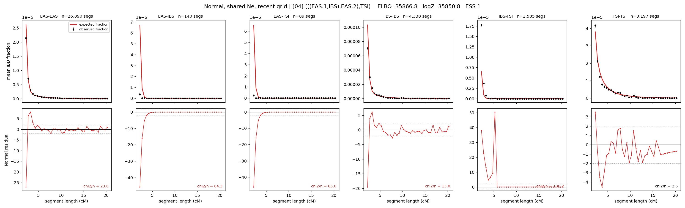

# `(((EAS.1,IBS),EAS.2),TSI)`

**Normal, shared Ne, recent grid** | topology 04 of 21 | admixed leaf: **EAS** | 4 events, 8 nodes

> Recent Ne grid: 0-5 and 5-10 generations. The first demographic event is explicitly constrained to occur after generation 10 (minimum 11 with the current one-generation gap).

## Model score

| quantity | value | |
|---|---|---|
| ELBO | -35866.84 | +- 0.17 (MC) |
| logZ (importance sampling) | -35850.84 | |
| ESS of the IS weights | 1.1 / 4000 | LOW -- treat logZ with suspicion |
| Stan dropped-constant correction | -29.61 | already applied |
| seed kept / runtime | 7 | 23 s |

## Events (in temporal order, most recent first)

| # | type | detail | time (gen) | cumulative |
|---|---|---|---|---|
| 1 | ADMIXTURE | EAS -> EAS.1 + EAS.2 | 191.2 +- 0.3 | 191.2 |
| 2 | MERGE | EAS.2 + IBS -> n1 | 1.0 +- 0.0 | 192.2 |
| 3 | MERGE | EAS.1 + n1 -> n2 | 1.0 +- 0.0 | 193.3 |
| 4 | MERGE | n2 + TSI -> root | 1.0 +- 0.0 | 194.3 |

## Admixture fraction

**f = 1.000 +- 0.000** (fraction from `EAS.1`; 0.000 from `EAS.2`)

Collapsed to a tree: one source carries <5% of the ancestry, so this graph is behaving as its no-admixture special case.

## Recent effective sizes shared by IBD and SNP (haploid)

| population | 0-5 gen | 5-10 gen |
|---|---:|---:|
| `EAS` | 4,460,625 | 3,422,668 |
| `IBS` | 4,984,729 | 3,236,753 |
| `TSI` | 4,678,211 | 2,904,378 |

## Effective sizes shared by IBD and SNP (haploid)

| node | Ne | sd of log Ne |
|---|---|---|
| `EAS` | 2,415,829 | 0.03 |
| `IBS` | 576,810 | 0.05 |
| `TSI` | 312,682 | 0.06 |
| `EAS.1` | 431 | 0.02 |
| `EAS.2` | 40 | 0.03 |
| `n1` | 41 | 0.03 |
| `n2` | 18,975 | 0.02 |
| `root` | 13,595 | 0.02 |

log-Ne random-walk step scale tau = 4.733

## Fit quality by component

| component | log-likelihood | n terms | chi2/n |
|---|---|---|---|
| IBD | -1,184.2 | 222 | 49.86 |
| SNP | -34,306.8 | 6 | 11450.13 |

IBD chi2/n uses Palamara model-derived Normal variance; SNP chi2/n uses its block SEs. Values near 1 indicate residuals on the modeled noise scale.

## SNP covariance residuals `(w_hat - W_pred)/w_se`

| | EAS | IBS | TSI |
|---|---|---|---|
| **EAS** | +110.28 | -96.65 | -121.41 |
| **IBS** | -96.65 | +48.62 | +145.17 |
| **TSI** | -121.41 | +145.17 | +94.93 |

