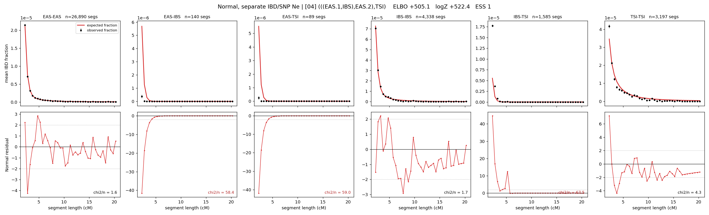

# `(((EAS.1,IBS),EAS.2),TSI)`

**Normal, separate IBD/SNP Ne** | topology 04 of 21 | admixed leaf: **EAS** | 4 events, 8 nodes

## Model score

| quantity | value | |
|---|---|---|
| ELBO | +505.10 | +- 0.17 (MC) |
| logZ (importance sampling) | +522.43 | |
| ESS of the IS weights | 1.1 / 4000 | LOW -- treat logZ with suspicion |
| Stan dropped-constant correction | -29.78 | already applied |
| mode kept / MAP start / runtime | 1 / 6 | 19 s |
| mode search | 12/12 MAP starts succeeded | 3 distinct modes evaluated |

## Events (in temporal order, most recent first)

| # | type | detail | time (gen) | cumulative |
|---|---|---|---|---|
| 1 | ADMIXTURE | EAS -> EAS.1 + EAS.2 | 124.5 +- 0.5 | 124.5 |
| 2 | MERGE | EAS.2 + IBS -> n1 | 1.1 +- 0.0 | 125.6 |
| 3 | MERGE | EAS.1 + n1 -> n2 | 18.2 +- 0.1 | 143.8 |
| 4 | MERGE | n2 + TSI -> root | 1.0 +- 0.0 | 144.8 |

## Admixture fraction

**f = 1.000 +- 0.000** (fraction from `EAS.1`; 0.000 from `EAS.2`)

Collapsed to a tree: one source carries <5% of the ancestry, so this graph is behaving as its no-admixture special case.

## Effective sizes for IBD (haploid)

| node | Ne | sd of log Ne |
|---|---|---|
| `EAS` | 2,721,095 | 0.03 |
| `IBS` | 628,499 | 0.08 |
| `TSI` | 328,584 | 0.03 |
| `EAS.1` | 32,966 | 0.02 |
| `EAS.2` | 7,195 | 0.03 |
| `n1` | 7,047 | 0.03 |
| `n2` | 97,649 | 0.03 |
| `root` | 83,459 | 0.03 |

log-Ne random-walk step scale tau_ibd = 1.495

## Effective sizes for SNP (haploid)

| node | Ne | sd of log Ne |
|---|---|---|
| `EAS` | 710 | 0.01 |
| `IBS` | 121,180 | 0.03 |
| `TSI` | 146,550 | 0.02 |
| `EAS.1` | 3,906 | 0.01 |
| `EAS.2` | 24,877 | 0.01 |
| `n1` | 25,764 | 0.01 |
| `n2` | 15,793 | 0.00 |
| `root` | 15,742 | 0.00 |

log-Ne random-walk step scale tau_snp = 1.050

## Fit quality by component

| component | log-likelihood | n terms | chi2/n |
|---|---|---|---|
| IBD | +681.2 | 222 | 32.18 |
| SNP | +40.2 | 6 | 1.13 |

IBD chi2/n uses Palamara model-derived Normal variance; SNP chi2/n uses its block SEs. Values near 1 indicate residuals on the modeled noise scale.

## SNP covariance residuals `(w_hat - W_pred)/w_se`

| | EAS | IBS | TSI |
|---|---|---|---|
| **EAS** | +0.05 | +0.34 | -0.45 |
| **IBS** | +0.34 | -0.82 | +0.18 |
| **TSI** | -0.45 | +0.18 | +0.69 |

