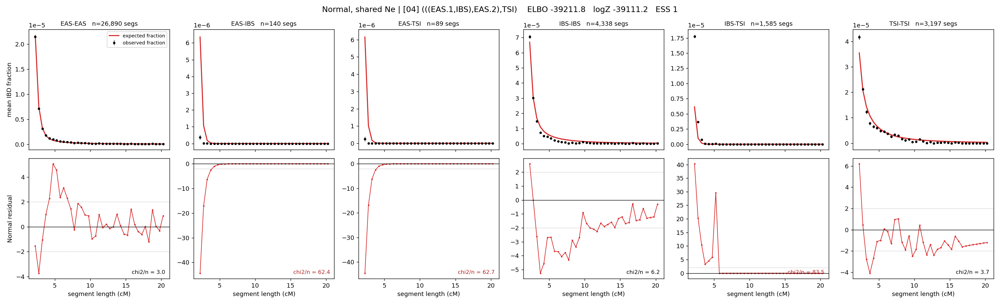

# `(((EAS.1,IBS),EAS.2),TSI)`

**Normal, shared Ne** | topology 04 of 21 | admixed leaf: **EAS** | 4 events, 8 nodes

## Model score

| quantity | value | |
|---|---|---|
| ELBO | -39211.84 | +- 1.62 (MC) |
| logZ (importance sampling) | -39111.16 | |
| ESS of the IS weights | 1.2 / 4000 | LOW -- treat logZ with suspicion |
| Stan dropped-constant correction | -24.10 | already applied |
| seed kept / runtime | 13 | 18 s |

## Events (in temporal order, most recent first)

| # | type | detail | time (gen) | cumulative |
|---|---|---|---|---|
| 1 | ADMIXTURE | EAS -> EAS.1 + EAS.2 | 101.4 +- 1.9 | 101.4 |
| 2 | MERGE | EAS.2 + IBS -> n1 | 12.8 +- 1.0 | 114.2 |
| 3 | MERGE | EAS.1 + n1 -> n2 | 60.1 +- 1.2 | 174.3 |
| 4 | MERGE | n2 + TSI -> root | 1.2 +- 0.0 | 175.5 |

## Admixture fraction

**f = 0.999 +- 0.000** (fraction from `EAS.1`; 0.001 from `EAS.2`)

Collapsed to a tree: one source carries <5% of the ancestry, so this graph is behaving as its no-admixture special case.

## Effective sizes shared by IBD and SNP (haploid)

| node | Ne | sd of log Ne |
|---|---|---|
| `EAS` | 3,221,650 | 0.07 |
| `IBS` | 359,025 | 0.05 |
| `TSI` | 337,547 | 0.08 |
| `EAS.1` | 121,991 | 0.07 |
| `EAS.2` | 27,025 | 0.06 |
| `n1` | 28,355 | 0.06 |
| `n2` | 44,124 | 0.06 |
| `root` | 27,439 | 0.06 |

log-Ne random-walk step scale tau = 0.498

## Fit quality by component

| component | log-likelihood | n terms | chi2/n |
|---|---|---|---|
| IBD | +124.5 | 222 | 37.55 |
| SNP | -39,040.3 | 6 | 13027.99 |

IBD chi2/n uses Palamara model-derived Normal variance; SNP chi2/n uses its block SEs. Values near 1 indicate residuals on the modeled noise scale.

## SNP covariance residuals `(w_hat - W_pred)/w_se`

| | EAS | IBS | TSI |
|---|---|---|---|
| **EAS** | +116.77 | -114.02 | -116.78 |
| **IBS** | -114.02 | +107.26 | +117.78 |
| **TSI** | -116.78 | +117.78 | +111.87 |

