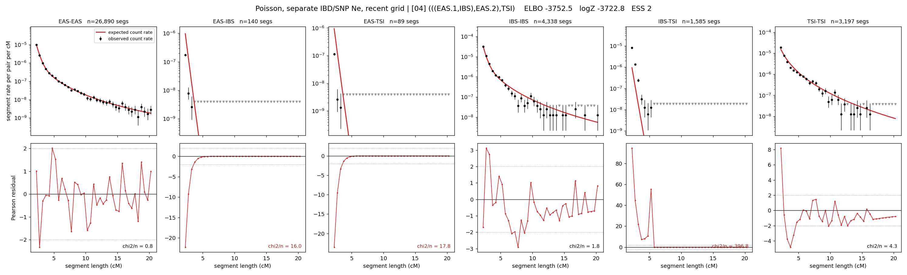

# `(((EAS.1,IBS),EAS.2),TSI)`

**Poisson, separate IBD/SNP Ne, recent grid** | topology 04 of 21 | admixed leaf: **EAS** | 4 events, 8 nodes

> Recent Ne grid: 0-5 and 5-10 generations. The first demographic event is explicitly constrained to occur after generation 10 (minimum 11 with the current one-generation gap).

## Model score

| quantity | value | |
|---|---|---|
| ELBO | -3752.51 | +- 0.35 (MC) |
| logZ (importance sampling) | -3722.78 | |
| ESS of the IS weights | 2.0 / 4000 | LOW -- treat logZ with suspicion |
| Stan dropped-constant correction | -40.81 | already applied |
| mode kept / MAP start / runtime | 2 / 6 | 26 s |
| mode search | 12/12 MAP starts succeeded | 3 distinct modes evaluated |

## Events (in temporal order, most recent first)

| # | type | detail | time (gen) | cumulative |
|---|---|---|---|---|
| 1 | ADMIXTURE | EAS -> EAS.1 + EAS.2 | 129.4 +- 0.4 | 129.4 |
| 2 | MERGE | EAS.2 + IBS -> n1 | 1.6 +- 0.0 | 131.0 |
| 3 | MERGE | EAS.1 + n1 -> n2 | 45.4 +- 0.5 | 176.4 |
| 4 | MERGE | n2 + TSI -> root | 1.0 +- 0.0 | 177.4 |

## Admixture fraction

**f = 1.000 +- 0.000** (fraction from `EAS.1`; 0.000 from `EAS.2`)

Collapsed to a tree: one source carries <5% of the ancestry, so this graph is behaving as its no-admixture special case.

## Recent effective sizes for IBD (haploid)

| population | 0-5 gen | 5-10 gen |
|---|---:|---:|
| `EAS` | 3,846,681 | 3,628,048 |
| `IBS` | 1,751,395 | 1,422,724 |
| `TSI` | 1,829,351 | 1,192,111 |

## Effective sizes for IBD (haploid)

| node | Ne | sd of log Ne |
|---|---|---|
| `EAS` | 2,506,189 | 0.04 |
| `IBS` | 547,824 | 0.07 |
| `TSI` | 306,242 | 0.02 |
| `EAS.1` | 37,789 | 0.02 |
| `EAS.2` | 10,089 | 0.03 |
| `n1` | 10,246 | 0.03 |
| `n2` | 101,978 | 0.01 |
| `root` | 77,152 | 0.01 |

log-Ne random-walk step scale tau_ibd = 1.787

## Recent effective sizes for SNP (haploid)

| population | 0-5 gen | 5-10 gen |
|---|---:|---:|
| `EAS` | 687 | 712 |
| `IBS` | 213,264 | 222,929 |
| `TSI` | 113,839 | 116,915 |

## Effective sizes for SNP (haploid)

| node | Ne | sd of log Ne |
|---|---|---|
| `EAS` | 779 | 0.01 |
| `IBS` | 229,569 | 0.03 |
| `TSI` | 117,311 | 0.05 |
| `EAS.1` | 3,707 | 0.01 |
| `EAS.2` | 54,782 | 0.02 |
| `n1` | 57,004 | 0.02 |
| `n2` | 18,170 | 0.00 |
| `root` | 17,849 | 0.00 |

log-Ne random-walk step scale tau_snp = 1.025

## Fit quality by component

| component | log-likelihood | n terms | chi2/n |
|---|---|---|---|
| IBD | -3,514.9 | 222 | 73.13 |
| SNP | +38.1 | 6 | 1.83 |

IBD chi2/n uses Poisson counting variance; SNP chi2/n uses its block SEs. Values near 1 indicate residuals on the modeled noise scale.

## SNP covariance residuals `(w_hat - W_pred)/w_se`

| | EAS | IBS | TSI |
|---|---|---|---|
| **EAS** | +0.02 | -0.06 | +0.01 |
| **IBS** | -0.06 | -0.22 | +0.36 |
| **TSI** | +0.01 | +0.36 | -0.37 |

