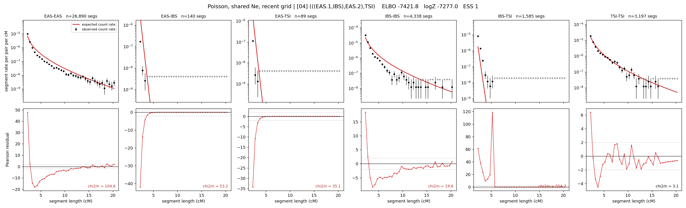

# `(((EAS.1,IBS),EAS.2),TSI)`

**Poisson, shared Ne, recent grid** | topology 04 of 21 | admixed leaf: **EAS** | 4 events, 8 nodes

> Recent Ne grid: 0-5 and 5-10 generations. The first demographic event is explicitly constrained to occur after generation 10 (minimum 11 with the current one-generation gap).

## Model score

| quantity | value | |
|---|---|---|
| ELBO | -7421.78 | +- 2.36 (MC) |
| logZ (importance sampling) | -7276.96 | |
| ESS of the IS weights | 1.1 / 4000 | LOW -- treat logZ with suspicion |
| Stan dropped-constant correction | -29.61 | already applied |
| seed kept / runtime | 13 | 20 s |

## Events (in temporal order, most recent first)

| # | type | detail | time (gen) | cumulative |
|---|---|---|---|---|
| 1 | ADMIXTURE | EAS -> EAS.1 + EAS.2 | 11.0 +- 0.0 | 11.0 |
| 2 | MERGE | EAS.2 + IBS -> n1 | 203.2 +- 18.5 | 214.2 |
| 3 | MERGE | EAS.1 + n1 -> n2 | 1.3 +- 0.1 | 215.5 |
| 4 | MERGE | n2 + TSI -> root | 2.4 +- 0.5 | 217.9 |

## Admixture fraction

**f = 1.000 +- 0.000** (fraction from `EAS.1`; 0.000 from `EAS.2`)

Collapsed to a tree: one source carries <5% of the ancestry, so this graph is behaving as its no-admixture special case.

## Recent effective sizes shared by IBD and SNP (haploid)

| population | 0-5 gen | 5-10 gen |
|---|---:|---:|
| `EAS` | 735,140,987,822 | 99,369,032,801 |
| `IBS` | 6,382,527,423 | 896,034,868 |
| `TSI` | 42,169,611 | 13,793,138 |

## Effective sizes shared by IBD and SNP (haploid)

| node | Ne | sd of log Ne |
|---|---|---|
| `EAS` | 8,773,586 | 0.42 |
| `IBS` | 248,531 | 0.10 |
| `TSI` | 312,836 | 0.07 |
| `EAS.1` | 1,060,894 | 0.07 |
| `EAS.2` | 0 | 0.94 |
| `n1` | 784 | 0.40 |
| `n2` | 2,101 | 0.09 |
| `root` | 11,917 | 0.71 |

log-Ne random-walk step scale tau = 3.986

## Fit quality by component

| component | log-likelihood | n terms | chi2/n |
|---|---|---|---|
| IBD | -6,975.9 | 222 | 260.34 |
| SNP | -36.9 | 6 | 26.85 |

IBD chi2/n uses Poisson counting variance; SNP chi2/n uses its block SEs. Values near 1 indicate residuals on the modeled noise scale.

## SNP covariance residuals `(w_hat - W_pred)/w_se`

| | EAS | IBS | TSI |
|---|---|---|---|
| **EAS** | +0.21 | +0.31 | -0.73 |
| **IBS** | +0.31 | -3.33 | +2.93 |
| **TSI** | -0.73 | +2.93 | -1.36 |

