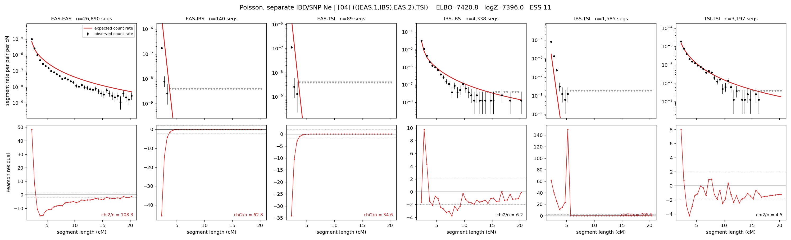

# `(((EAS.1,IBS),EAS.2),TSI)`

**Poisson, separate IBD/SNP Ne** | topology 04 of 21 | admixed leaf: **EAS** | 4 events, 8 nodes

## Model score

| quantity | value | |
|---|---|---|
| ELBO | -7420.76 | +- 0.38 (MC) |
| logZ (importance sampling) | -7396.02 | |
| ESS of the IS weights | 10.8 / 4000 | LOW -- treat logZ with suspicion |
| Stan dropped-constant correction | -29.78 | already applied |
| seed kept / runtime | 13 | 16 s |

## Events (in temporal order, most recent first)

| # | type | detail | time (gen) | cumulative |
|---|---|---|---|---|
| 1 | ADMIXTURE | EAS -> EAS.1 + EAS.2 | 1.0 +- 0.0 | 1.0 |
| 2 | MERGE | EAS.2 + IBS -> n1 | 218.7 +- 3.0 | 219.7 |
| 3 | MERGE | EAS.1 + n1 -> n2 | 1.0 +- 0.0 | 220.7 |
| 4 | MERGE | n2 + TSI -> root | 1.0 +- 0.0 | 221.7 |

## Admixture fraction

**f = 1.000 +- 0.000** (fraction from `EAS.1`; 0.000 from `EAS.2`)

Collapsed to a tree: one source carries <5% of the ancestry, so this graph is behaving as its no-admixture special case.

## Effective sizes for IBD (haploid)

| node | Ne | sd of log Ne |
|---|---|---|
| `EAS` | 1,759,259 | 0.06 |
| `IBS` | 440,744 | 0.05 |
| `TSI` | 329,840 | 0.02 |
| `EAS.1` | 1,207,099 | 0.03 |
| `EAS.2` | 1,256 | 0.66 |
| `n1` | 29 | 0.11 |
| `n2` | 425 | 0.09 |
| `root` | 9,102 | 0.12 |

log-Ne random-walk step scale tau_ibd = 3.778

## Effective sizes for SNP (haploid)

| node | Ne | sd of log Ne |
|---|---|---|
| `EAS` | 1,324 | 0.01 |
| `IBS` | 192,459 | 0.09 |
| `TSI` | 173,429 | 0.08 |
| `EAS.1` | 1,223 | 0.02 |
| `EAS.2` | 13,255 | 0.13 |
| `n1` | 9,688 | 0.18 |
| `n2` | 9,585 | 0.19 |
| `root` | 14,358 | 0.12 |

log-Ne random-walk step scale tau_snp = 1.009

## Fit quality by component

| component | log-likelihood | n terms | chi2/n |
|---|---|---|---|
| IBD | -7,109.1 | 222 | 172.09 |
| SNP | +35.0 | 6 | 2.87 |

IBD chi2/n uses Poisson counting variance; SNP chi2/n uses its block SEs. Values near 1 indicate residuals on the modeled noise scale.

## SNP covariance residuals `(w_hat - W_pred)/w_se`

| | EAS | IBS | TSI |
|---|---|---|---|
| **EAS** | -0.04 | +0.03 | +0.04 |
| **IBS** | +0.03 | +0.05 | -0.12 |
| **TSI** | +0.04 | -0.12 | +0.04 |

