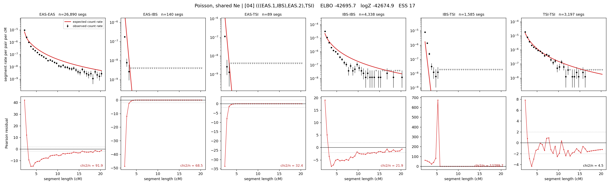

# `(((EAS.1,IBS),EAS.2),TSI)`

**Poisson, shared Ne** | topology 04 of 21 | admixed leaf: **EAS** | 4 events, 8 nodes

## Model score

| quantity | value | |
|---|---|---|
| ELBO | -42695.67 | +- 0.33 (MC) |
| logZ (importance sampling) | -42674.91 | |
| ESS of the IS weights | 16.9 / 4000 | LOW -- treat logZ with suspicion |
| Stan dropped-constant correction | -24.10 | already applied |
| seed kept / runtime | 13 | 15 s |

## Events (in temporal order, most recent first)

| # | type | detail | time (gen) | cumulative |
|---|---|---|---|---|
| 1 | ADMIXTURE | EAS -> EAS.1 + EAS.2 | 1.0 +- 0.0 | 1.0 |
| 2 | MERGE | EAS.2 + IBS -> n1 | 268.6 +- 0.4 | 269.6 |
| 3 | MERGE | EAS.1 + n1 -> n2 | 1.0 +- 0.0 | 270.6 |
| 4 | MERGE | n2 + TSI -> root | 1.0 +- 0.0 | 271.6 |

## Admixture fraction

**f = 1.000 +- 0.000** (fraction from `EAS.1`; 0.000 from `EAS.2`)

Collapsed to a tree: one source carries <5% of the ancestry, so this graph is behaving as its no-admixture special case.

## Effective sizes shared by IBD and SNP (haploid)

| node | Ne | sd of log Ne |
|---|---|---|
| `EAS` | 2,291,171 | 0.08 |
| `IBS` | 270,483 | 0.03 |
| `TSI` | 328,674 | 0.04 |
| `EAS.1` | 1,231,339 | 0.04 |
| `EAS.2` | 868 | 0.56 |
| `n1` | 51 | 0.06 |
| `n2` | 55 | 0.03 |
| `root` | 1,548 | 0.01 |

log-Ne random-walk step scale tau = 3.222

## Fit quality by component

| component | log-likelihood | n terms | chi2/n |
|---|---|---|---|
| IBD | -7,471.8 | 222 | 2173.22 |
| SNP | -34,844.4 | 6 | 11629.32 |

IBD chi2/n uses Poisson counting variance; SNP chi2/n uses its block SEs. Values near 1 indicate residuals on the modeled noise scale.

## SNP covariance residuals `(w_hat - W_pred)/w_se`

| | EAS | IBS | TSI |
|---|---|---|---|
| **EAS** | +111.07 | -108.68 | -110.86 |
| **IBS** | -108.68 | +52.14 | +165.97 |
| **TSI** | -110.86 | +165.97 | +55.26 |

