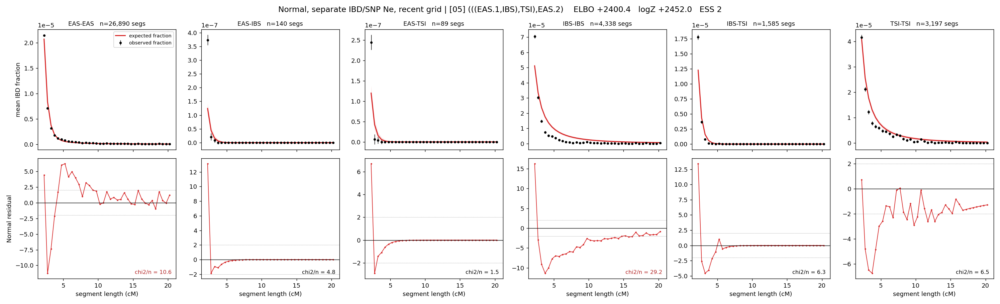

# `(((EAS.1,IBS),TSI),EAS.2)`

**Normal, separate IBD/SNP Ne, recent grid** | topology 05 of 21 | admixed leaf: **EAS** | 4 events, 8 nodes

> Recent Ne grid: 0-5 and 5-10 generations. The first demographic event is explicitly constrained to occur after generation 10 (minimum 11 with the current one-generation gap).

## Model score

| quantity | value | |
|---|---|---|
| ELBO | +2400.43 | +- 0.77 (MC) |
| logZ (importance sampling) | +2452.00 | |
| ESS of the IS weights | 1.8 / 4000 | LOW -- treat logZ with suspicion |
| Stan dropped-constant correction | -40.81 | already applied |
| seed kept / runtime | 1 | 26 s |

## Events (in temporal order, most recent first)

| # | type | detail | time (gen) | cumulative |
|---|---|---|---|---|
| 1 | ADMIXTURE | EAS -> EAS.1 + EAS.2 | 92.4 +- 0.2 | 92.4 |
| 2 | MERGE | EAS.2 + IBS -> n1 | 1.5 +- 0.0 | 93.9 |
| 3 | MERGE | n1 + TSI -> n2 | 1.5 +- 0.0 | 95.4 |
| 4 | MERGE | EAS.1 + n2 -> root | 14,088.8 +- 136.8 | 14,184.1 |

## Admixture fraction

**f = 0.990 +- 0.000** (fraction from `EAS.1`; 0.010 from `EAS.2`)

Collapsed to a tree: one source carries <5% of the ancestry, so this graph is behaving as its no-admixture special case.

## Recent effective sizes for IBD (haploid)

| population | 0-5 gen | 5-10 gen |
|---|---:|---:|
| `EAS` | 3,517,853 | 3,834,480 |
| `IBS` | 210,902 | 212,279 |
| `TSI` | 303,960 | 296,472 |

## Effective sizes for IBD (haploid)

| node | Ne | sd of log Ne |
|---|---|---|
| `EAS` | 3,783,581 | 0.03 |
| `IBS` | 205,358 | 0.06 |
| `TSI` | 278,846 | 0.06 |
| `EAS.1` | 117,040 | 0.01 |
| `EAS.2` | 176,876 | 0.06 |
| `n1` | 176,387 | 0.06 |
| `n2` | 168,104 | 0.06 |
| `root` | 2,892 | 0.01 |

log-Ne random-walk step scale tau_ibd = 0.445

## Recent effective sizes for SNP (haploid)

| population | 0-5 gen | 5-10 gen |
|---|---:|---:|
| `EAS` | 50 | 106 |
| `IBS` | 1,450,961,873 | 1,898,678,804 |
| `TSI` | 590,807,850 | 735,433,046 |

## Effective sizes for SNP (haploid)

| node | Ne | sd of log Ne |
|---|---|---|
| `EAS` | 2,526 | 0.02 |
| `IBS` | 4,203,149,751 | 0.07 |
| `TSI` | 1,558,495,452 | 0.07 |
| `EAS.1` | 19,113,760 | 0.04 |
| `EAS.2` | 44,468,298,512 | 0.08 |
| `n1` | 44,773,809,256 | 0.08 |
| `n2` | 57,512,767,664 | 0.08 |
| `root` | 3,217,681 | 0.01 |

log-Ne random-walk step scale tau_snp = 1.432

## Fit quality by component

| component | log-likelihood | n terms | chi2/n |
|---|---|---|---|
| IBD | +3,035.7 | 222 | 10.01 |
| SNP | +0.7 | 6 | 14.30 |

IBD chi2/n uses Palamara model-derived Normal variance; SNP chi2/n uses its block SEs. Values near 1 indicate residuals on the modeled noise scale.

## SNP covariance residuals `(w_hat - W_pred)/w_se`

| | EAS | IBS | TSI |
|---|---|---|---|
| **EAS** | -0.39 | +0.45 | +0.33 |
| **IBS** | +0.45 | +3.23 | -4.38 |
| **TSI** | +0.33 | -4.38 | +3.50 |

