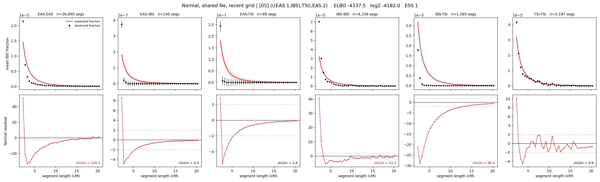

# `(((EAS.1,IBS),TSI),EAS.2)`

**Normal, shared Ne, recent grid** | topology 05 of 21 | admixed leaf: **EAS** | 4 events, 8 nodes

> Recent Ne grid: 0-5 and 5-10 generations. The first demographic event is explicitly constrained to occur after generation 10 (minimum 11 with the current one-generation gap).

## Model score

| quantity | value | |
|---|---|---|
| ELBO | -4337.53 | +- 2.50 (MC) |
| logZ (importance sampling) | -4181.97 | |
| ESS of the IS weights | 1.0 / 4000 | LOW -- treat logZ with suspicion |
| Stan dropped-constant correction | -29.61 | already applied |
| seed kept / runtime | 7 | 23 s |

## Events (in temporal order, most recent first)

| # | type | detail | time (gen) | cumulative |
|---|---|---|---|---|
| 1 | ADMIXTURE | EAS -> EAS.1 + EAS.2 | 11.0 +- 0.0 | 11.0 |
| 2 | MERGE | EAS.2 + IBS -> n1 | 1.0 +- 0.0 | 12.0 |
| 3 | MERGE | n1 + TSI -> n2 | 1.0 +- 0.0 | 13.0 |
| 4 | MERGE | EAS.1 + n2 -> root | 38,742.6 +- 1,010.0 | 38,755.6 |

## Admixture fraction

**f = 0.994 +- 0.002** (fraction from `EAS.1`; 0.006 from `EAS.2`)

Collapsed to a tree: one source carries <5% of the ancestry, so this graph is behaving as its no-admixture special case.

## Recent effective sizes shared by IBD and SNP (haploid)

| population | 0-5 gen | 5-10 gen |
|---|---:|---:|
| `EAS` | 70,107,854 | 34,220,328 |
| `IBS` | 1,335,589 | 1,052,626 |
| `TSI` | 1,400,390 | 1,147,989 |

## Effective sizes shared by IBD and SNP (haploid)

| node | Ne | sd of log Ne |
|---|---|---|
| `EAS` | 1,707,411 | 0.05 |
| `IBS` | 514,959 | 0.04 |
| `TSI` | 575,500 | 0.04 |
| `EAS.1` | 671,890 | 0.05 |
| `EAS.2` | 373,211 | 0.04 |
| `n1` | 371,225 | 0.04 |
| `n2` | 308,352 | 0.04 |
| `root` | 6,150 | 0.02 |

log-Ne random-walk step scale tau = 2.275

## Fit quality by component

| component | log-likelihood | n terms | chi2/n |
|---|---|---|---|
| IBD | -3,653.8 | 222 | 64.25 |
| SNP | -58.8 | 6 | 34.13 |

IBD chi2/n uses Palamara model-derived Normal variance; SNP chi2/n uses its block SEs. Values near 1 indicate residuals on the modeled noise scale.

## SNP covariance residuals `(w_hat - W_pred)/w_se`

| | EAS | IBS | TSI |
|---|---|---|---|
| **EAS** | -0.31 | +0.37 | +0.25 |
| **IBS** | +0.37 | +3.27 | -4.26 |
| **TSI** | +0.25 | -4.26 | +3.54 |

