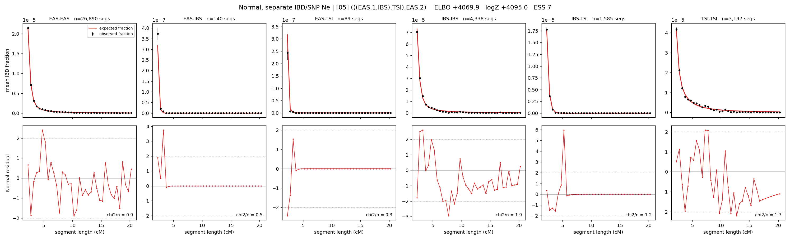

# `(((EAS.1,IBS),TSI),EAS.2)`

**Normal, separate IBD/SNP Ne** | topology 05 of 21 | admixed leaf: **EAS** | 4 events, 8 nodes

## Model score

| quantity | value | |
|---|---|---|
| ELBO | +4069.93 | +- 0.43 (MC) |
| logZ (importance sampling) | +4095.00 | |
| ESS of the IS weights | 7.5 / 4000 | LOW -- treat logZ with suspicion |
| Stan dropped-constant correction | -29.78 | already applied |
| mode kept / MAP start / runtime | 1 / 6 | 21 s |
| mode search | 12/12 MAP starts succeeded | 3 distinct modes evaluated |

## Events (in temporal order, most recent first)

| # | type | detail | time (gen) | cumulative |
|---|---|---|---|---|
| 1 | ADMIXTURE | EAS -> EAS.1 + EAS.2 | 122.8 +- 0.5 | 122.8 |
| 2 | MERGE | EAS.2 + IBS -> n1 | 2.3 +- 0.0 | 125.1 |
| 3 | MERGE | n1 + TSI -> n2 | 15.4 +- 0.2 | 140.4 |
| 4 | MERGE | EAS.1 + n2 -> root | 147.4 +- 0.8 | 287.8 |

## Admixture fraction

**f = 1.000 +- 0.000** (fraction from `EAS.1`; 0.000 from `EAS.2`)

Collapsed to a tree: one source carries <5% of the ancestry, so this graph is behaving as its no-admixture special case.

## Effective sizes for IBD (haploid)

| node | Ne | sd of log Ne |
|---|---|---|
| `EAS` | 2,640,767 | 0.04 |
| `IBS` | 617,534 | 0.06 |
| `TSI` | 403,952 | 0.05 |
| `EAS.1` | 52,266 | 0.01 |
| `EAS.2` | 8,095 | 0.03 |
| `n1` | 8,070 | 0.03 |
| `n2` | 30,609 | 0.02 |
| `root` | 10,092 | 0.02 |

log-Ne random-walk step scale tau_ibd = 1.415

## Effective sizes for SNP (haploid)

| node | Ne | sd of log Ne |
|---|---|---|
| `EAS` | 1,121 | 0.02 |
| `IBS` | 115,504 | 0.04 |
| `TSI` | 95,412 | 0.03 |
| `EAS.1` | 2,409 | 0.01 |
| `EAS.2` | 68,200 | 0.02 |
| `n1` | 68,144 | 0.02 |
| `n2` | 64,118 | 0.02 |
| `root` | 20,075 | 0.01 |

log-Ne random-walk step scale tau_snp = 0.843

## Fit quality by component

| component | log-likelihood | n terms | chi2/n |
|---|---|---|---|
| IBD | +4,236.3 | 222 | 1.19 |
| SNP | +32.5 | 6 | 3.72 |

IBD chi2/n uses Palamara model-derived Normal variance; SNP chi2/n uses its block SEs. Values near 1 indicate residuals on the modeled noise scale.

## SNP covariance residuals `(w_hat - W_pred)/w_se`

| | EAS | IBS | TSI |
|---|---|---|---|
| **EAS** | -0.02 | +0.00 | +0.03 |
| **IBS** | +0.00 | -0.08 | +0.08 |
| **TSI** | +0.03 | +0.08 | -0.14 |

