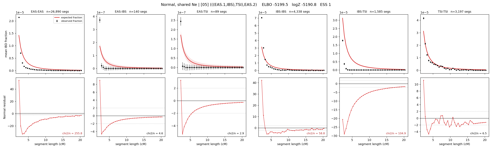

# `(((EAS.1,IBS),TSI),EAS.2)`

**Normal, shared Ne** | topology 05 of 21 | admixed leaf: **EAS** | 4 events, 8 nodes

## Model score

| quantity | value | |
|---|---|---|
| ELBO | -5199.46 | +- 0.08 (MC) |
| logZ (importance sampling) | -5190.76 | |
| ESS of the IS weights | 1.5 / 4000 | LOW -- treat logZ with suspicion |
| Stan dropped-constant correction | -24.10 | already applied |
| seed kept / runtime | 13 | 9 s |

## Events (in temporal order, most recent first)

| # | type | detail | time (gen) | cumulative |
|---|---|---|---|---|
| 1 | ADMIXTURE | EAS -> EAS.1 + EAS.2 | 1.0 +- 0.0 | 1.0 |
| 2 | MERGE | EAS.2 + IBS -> n1 | 1.0 +- 0.0 | 2.0 |
| 3 | MERGE | n1 + TSI -> n2 | 1.0 +- 0.0 | 3.0 |
| 4 | MERGE | EAS.1 + n2 -> root | 40,151.8 +- 459.1 | 40,154.8 |

## Admixture fraction

**f = 0.995 +- 0.000** (fraction from `EAS.1`; 0.005 from `EAS.2`)

Collapsed to a tree: one source carries <5% of the ancestry, so this graph is behaving as its no-admixture special case.

## Effective sizes shared by IBD and SNP (haploid)

| node | Ne | sd of log Ne |
|---|---|---|
| `EAS` | 694,042 | 0.01 |
| `IBS` | 320,298 | 0.01 |
| `TSI` | 320,290 | 0.01 |
| `EAS.1` | 696,977 | 0.01 |
| `EAS.2` | 320,304 | 0.01 |
| `n1` | 320,296 | 0.01 |
| `n2` | 320,287 | 0.01 |
| `root` | 364,762 | 0.00 |

log-Ne random-walk step scale tau = 0.024

## Fit quality by component

| component | log-likelihood | n terms | chi2/n |
|---|---|---|---|
| IBD | -4,617.2 | 222 | 72.26 |
| SNP | +18.1 | 6 | 8.51 |

IBD chi2/n uses Palamara model-derived Normal variance; SNP chi2/n uses its block SEs. Values near 1 indicate residuals on the modeled noise scale.

## SNP covariance residuals `(w_hat - W_pred)/w_se`

| | EAS | IBS | TSI |
|---|---|---|---|
| **EAS** | +0.07 | -0.00 | -0.13 |
| **IBS** | -0.00 | +3.64 | -3.89 |
| **TSI** | -0.13 | -3.89 | +3.91 |

