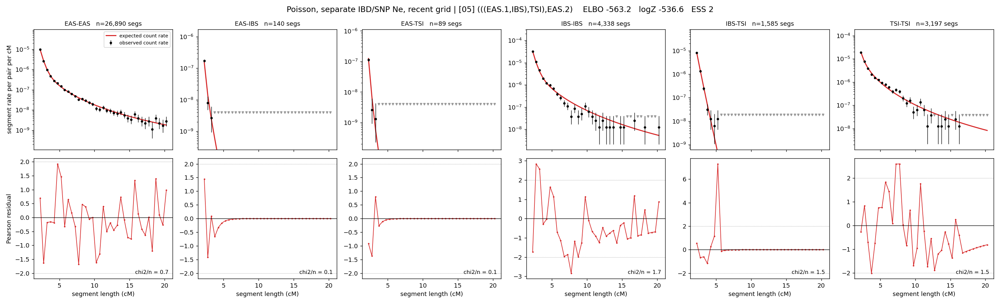

# `(((EAS.1,IBS),TSI),EAS.2)`

**Poisson, separate IBD/SNP Ne, recent grid** | topology 05 of 21 | admixed leaf: **EAS** | 4 events, 8 nodes

> Recent Ne grid: 0-5 and 5-10 generations. The first demographic event is explicitly constrained to occur after generation 10 (minimum 11 with the current one-generation gap).

## Model score

| quantity | value | |
|---|---|---|
| ELBO | -563.21 | +- 0.30 (MC) |
| logZ (importance sampling) | -536.59 | |
| ESS of the IS weights | 1.9 / 4000 | LOW -- treat logZ with suspicion |
| Stan dropped-constant correction | -40.81 | already applied |
| mode kept / MAP start / runtime | 1 / 11 | 27 s |
| mode search | 12/12 MAP starts succeeded | 3 distinct modes evaluated |

## Events (in temporal order, most recent first)

| # | type | detail | time (gen) | cumulative |
|---|---|---|---|---|
| 1 | ADMIXTURE | EAS -> EAS.1 + EAS.2 | 125.7 +- 0.6 | 125.7 |
| 2 | MERGE | EAS.2 + IBS -> n1 | 2.6 +- 0.1 | 128.3 |
| 3 | MERGE | n1 + TSI -> n2 | 18.0 +- 0.5 | 146.3 |
| 4 | MERGE | EAS.1 + n2 -> root | 153.1 +- 1.6 | 299.3 |

## Admixture fraction

**f = 0.998 +- 0.000** (fraction from `EAS.1`; 0.002 from `EAS.2`)

Collapsed to a tree: one source carries <5% of the ancestry, so this graph is behaving as its no-admixture special case.

## Recent effective sizes for IBD (haploid)

| population | 0-5 gen | 5-10 gen |
|---|---:|---:|
| `EAS` | 4,124,953 | 3,466,590 |
| `IBS` | 1,876,998 | 1,447,681 |
| `TSI` | 1,148,474 | 900,502 |

## Effective sizes for IBD (haploid)

| node | Ne | sd of log Ne |
|---|---|---|
| `EAS` | 2,503,167 | 0.04 |
| `IBS` | 563,558 | 0.04 |
| `TSI` | 391,117 | 0.06 |
| `EAS.1` | 47,951 | 0.02 |
| `EAS.2` | 8,059 | 0.05 |
| `n1` | 8,636 | 0.03 |
| `n2` | 25,343 | 0.02 |
| `root` | 8,750 | 0.01 |

log-Ne random-walk step scale tau_ibd = 1.658

## Recent effective sizes for SNP (haploid)

| population | 0-5 gen | 5-10 gen |
|---|---:|---:|
| `EAS` | 1,250 | 1,199 |
| `IBS` | 112,145 | 114,519 |
| `TSI` | 100,126 | 98,748 |

## Effective sizes for SNP (haploid)

| node | Ne | sd of log Ne |
|---|---|---|
| `EAS` | 1,188 | 0.01 |
| `IBS` | 113,885 | 0.05 |
| `TSI` | 102,120 | 0.05 |
| `EAS.1` | 2,383 | 0.01 |
| `EAS.2` | 79,622 | 0.06 |
| `n1` | 78,592 | 0.05 |
| `n2` | 73,753 | 0.06 |
| `root` | 14,199 | 0.02 |

log-Ne random-walk step scale tau_snp = 0.757

## Fit quality by component

| component | log-likelihood | n terms | chi2/n |
|---|---|---|---|
| IBD | -358.6 | 222 | 1.05 |
| SNP | +37.5 | 6 | 2.03 |

IBD chi2/n uses Poisson counting variance; SNP chi2/n uses its block SEs. Values near 1 indicate residuals on the modeled noise scale.

## SNP covariance residuals `(w_hat - W_pred)/w_se`

| | EAS | IBS | TSI |
|---|---|---|---|
| **EAS** | +0.05 | -0.03 | -0.07 |
| **IBS** | -0.03 | -0.11 | +0.18 |
| **TSI** | -0.07 | +0.18 | -0.02 |

