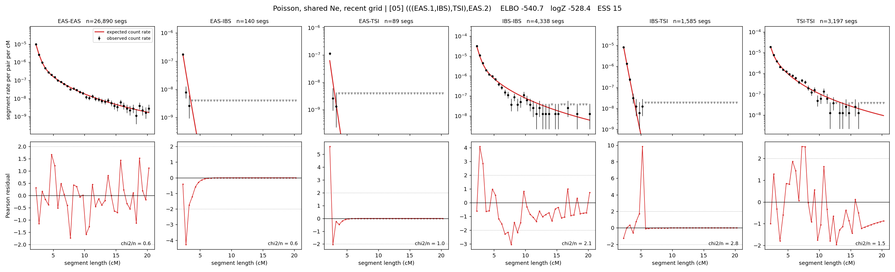

# `(((EAS.1,IBS),TSI),EAS.2)`

**Poisson, shared Ne, recent grid** | topology 05 of 21 | admixed leaf: **EAS** | 4 events, 8 nodes

> Recent Ne grid: 0-5 and 5-10 generations. The first demographic event is explicitly constrained to occur after generation 10 (minimum 11 with the current one-generation gap).

## Model score

| quantity | value | |
|---|---|---|
| ELBO | -540.73 | +- 0.19 (MC) |
| logZ (importance sampling) | -528.36 | |
| ESS of the IS weights | 14.7 / 4000 | LOW -- treat logZ with suspicion |
| Stan dropped-constant correction | -29.61 | already applied |
| mode kept / MAP start / runtime | 1 / 7 | 26 s |
| mode search | 12/12 MAP starts succeeded | 3 distinct modes evaluated |

## Events (in temporal order, most recent first)

| # | type | detail | time (gen) | cumulative |
|---|---|---|---|---|
| 1 | ADMIXTURE | EAS -> EAS.1 + EAS.2 | 129.0 +- 0.6 | 129.0 |
| 2 | MERGE | EAS.2 + IBS -> n1 | 3.4 +- 0.2 | 132.3 |
| 3 | MERGE | n1 + TSI -> n2 | 24.6 +- 2.0 | 157.0 |
| 4 | MERGE | EAS.1 + n2 -> root | 2,205.1 +- 93.3 | 2,362.0 |

## Admixture fraction

**f = 0.993 +- 0.000** (fraction from `EAS.1`; 0.007 from `EAS.2`)

Collapsed to a tree: one source carries <5% of the ancestry, so this graph is behaving as its no-admixture special case.

## Recent effective sizes shared by IBD and SNP (haploid)

| population | 0-5 gen | 5-10 gen |
|---|---:|---:|
| `EAS` | 4,639,564 | 3,779,480 |
| `IBS` | 1,659,363 | 1,201,337 |
| `TSI` | 985,491 | 691,514 |

## Effective sizes shared by IBD and SNP (haploid)

| node | Ne | sd of log Ne |
|---|---|---|
| `EAS` | 2,443,281 | 0.02 |
| `IBS` | 519,496 | 0.04 |
| `TSI` | 398,541 | 0.05 |
| `EAS.1` | 42,431 | 0.01 |
| `EAS.2` | 9,834 | 0.07 |
| `n1` | 10,672 | 0.06 |
| `n2` | 16,945 | 0.06 |
| `root` | 24,669 | 0.37 |

log-Ne random-walk step scale tau = 1.605

## Fit quality by component

| component | log-likelihood | n terms | chi2/n |
|---|---|---|---|
| IBD | -396.0 | 222 | 1.53 |
| SNP | +34.8 | 6 | 2.94 |

IBD chi2/n uses Poisson counting variance; SNP chi2/n uses its block SEs. Values near 1 indicate residuals on the modeled noise scale.

## SNP covariance residuals `(w_hat - W_pred)/w_se`

| | EAS | IBS | TSI |
|---|---|---|---|
| **EAS** | +0.03 | +1.05 | -1.13 |
| **IBS** | +1.05 | -2.34 | +0.35 |
| **TSI** | -1.13 | +0.35 | +1.81 |

