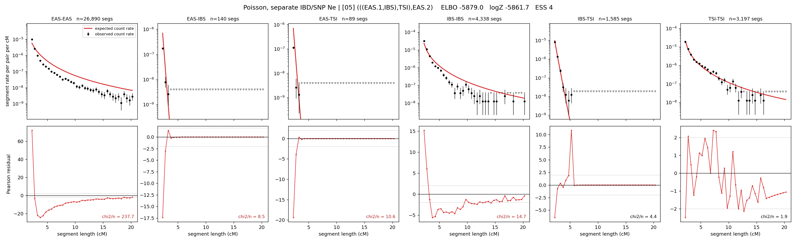

# `(((EAS.1,IBS),TSI),EAS.2)`

**Poisson, separate IBD/SNP Ne** | topology 05 of 21 | admixed leaf: **EAS** | 4 events, 8 nodes

## Model score

| quantity | value | |
|---|---|---|
| ELBO | -5879.01 | +- 0.19 (MC) |
| logZ (importance sampling) | -5861.74 | |
| ESS of the IS weights | 4.1 / 4000 | LOW -- treat logZ with suspicion |
| Stan dropped-constant correction | -29.78 | already applied |
| seed kept / runtime | 13 | 17 s |

## Events (in temporal order, most recent first)

| # | type | detail | time (gen) | cumulative |
|---|---|---|---|---|
| 1 | ADMIXTURE | EAS -> EAS.1 + EAS.2 | 1.0 +- 0.0 | 1.0 |
| 2 | MERGE | EAS.2 + IBS -> n1 | 159.3 +- 0.6 | 160.3 |
| 3 | MERGE | n1 + TSI -> n2 | 1.0 +- 0.0 | 161.3 |
| 4 | MERGE | EAS.1 + n2 -> root | 147.9 +- 0.2 | 309.2 |

## Admixture fraction

**f = 1.000 +- 0.000** (fraction from `EAS.1`; 0.000 from `EAS.2`)

Collapsed to a tree: one source carries <5% of the ancestry, so this graph is behaving as its no-admixture special case.

## Effective sizes for IBD (haploid)

| node | Ne | sd of log Ne |
|---|---|---|
| `EAS` | 811,114 | 0.02 |
| `IBS` | 319,069 | 0.03 |
| `TSI` | 422,675 | 0.03 |
| `EAS.1` | 895,795 | 0.02 |
| `EAS.2` | 17,035 | 0.03 |
| `n1` | 13,686 | 0.03 |
| `n2` | 13,616 | 0.03 |
| `root` | 951 | 0.00 |

log-Ne random-walk step scale tau_ibd = 1.281

## Effective sizes for SNP (haploid)

| node | Ne | sd of log Ne |
|---|---|---|
| `EAS` | 219,200 | 0.03 |
| `IBS` | 217,057 | 0.05 |
| `TSI` | 135,856 | 0.02 |
| `EAS.1` | 247,808 | 0.03 |
| `EAS.2` | 375 | 0.01 |
| `n1` | 929 | 0.01 |
| `n2` | 826 | 0.01 |
| `root` | 7,738 | 0.00 |

log-Ne random-walk step scale tau_snp = 1.353

## Fit quality by component

| component | log-likelihood | n terms | chi2/n |
|---|---|---|---|
| IBD | -5,671.1 | 222 | 46.41 |
| SNP | +39.1 | 6 | 1.51 |

IBD chi2/n uses Poisson counting variance; SNP chi2/n uses its block SEs. Values near 1 indicate residuals on the modeled noise scale.

## SNP covariance residuals `(w_hat - W_pred)/w_se`

| | EAS | IBS | TSI |
|---|---|---|---|
| **EAS** | +0.05 | +0.32 | -0.41 |
| **IBS** | +0.32 | -1.05 | +0.48 |
| **TSI** | -0.41 | +0.48 | +0.34 |

