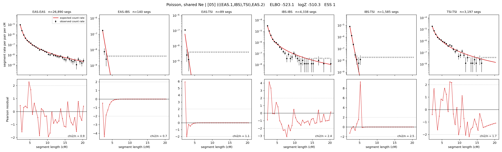

# `(((EAS.1,IBS),TSI),EAS.2)`

**Poisson, shared Ne** | topology 05 of 21 | admixed leaf: **EAS** | 4 events, 8 nodes

## Model score

| quantity | value | |
|---|---|---|
| ELBO | -523.09 | +- 0.13 (MC) |
| logZ (importance sampling) | -510.31 | |
| ESS of the IS weights | 1.1 / 4000 | LOW -- treat logZ with suspicion |
| Stan dropped-constant correction | -24.10 | already applied |
| mode kept / MAP start / runtime | 2 / 7 | 18 s |
| mode search | 10/12 MAP starts succeeded | 3 distinct modes evaluated |

## Events (in temporal order, most recent first)

| # | type | detail | time (gen) | cumulative |
|---|---|---|---|---|
| 1 | ADMIXTURE | EAS -> EAS.1 + EAS.2 | 125.8 +- 0.4 | 125.8 |
| 2 | MERGE | EAS.2 + IBS -> n1 | 2.9 +- 0.0 | 128.8 |
| 3 | MERGE | n1 + TSI -> n2 | 26.3 +- 0.5 | 155.1 |
| 4 | MERGE | EAS.1 + n2 -> root | 2,354.9 +- 11.1 | 2,510.0 |

## Admixture fraction

**f = 0.993 +- 0.000** (fraction from `EAS.1`; 0.007 from `EAS.2`)

Collapsed to a tree: one source carries <5% of the ancestry, so this graph is behaving as its no-admixture special case.

## Effective sizes shared by IBD and SNP (haploid)

| node | Ne | sd of log Ne |
|---|---|---|
| `EAS` | 2,604,273 | 0.02 |
| `IBS` | 572,689 | 0.04 |
| `TSI` | 410,579 | 0.03 |
| `EAS.1` | 46,205 | 0.02 |
| `EAS.2` | 9,693 | 0.02 |
| `n1` | 11,739 | 0.02 |
| `n2` | 17,944 | 0.01 |
| `root` | 13,492 | 0.01 |

log-Ne random-walk step scale tau = 1.354

## Fit quality by component

| component | log-likelihood | n terms | chi2/n |
|---|---|---|---|
| IBD | -420.7 | 222 | 1.61 |
| SNP | +35.8 | 6 | 2.59 |

IBD chi2/n uses Poisson counting variance; SNP chi2/n uses its block SEs. Values near 1 indicate residuals on the modeled noise scale.

## SNP covariance residuals `(w_hat - W_pred)/w_se`

| | EAS | IBS | TSI |
|---|---|---|---|
| **EAS** | +0.05 | +1.00 | -1.11 |
| **IBS** | +1.00 | -2.14 | +0.25 |
| **TSI** | -1.11 | +0.25 | +1.88 |

