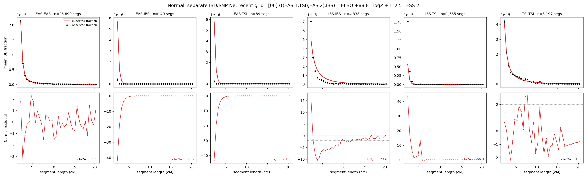

# `(((EAS.1,TSI),EAS.2),IBS)`

**Normal, separate IBD/SNP Ne, recent grid** | topology 06 of 21 | admixed leaf: **EAS** | 4 events, 8 nodes

> Recent Ne grid: 0-5 and 5-10 generations. The first demographic event is explicitly constrained to occur after generation 10 (minimum 11 with the current one-generation gap).

## Model score

| quantity | value | |
|---|---|---|
| ELBO | +88.84 | +- 0.32 (MC) |
| logZ (importance sampling) | +112.54 | |
| ESS of the IS weights | 2.4 / 4000 | LOW -- treat logZ with suspicion |
| Stan dropped-constant correction | -40.81 | already applied |
| mode kept / MAP start / runtime | 1 / 7 | 25 s |
| mode search | 12/12 MAP starts succeeded | 3 distinct modes evaluated |

## Events (in temporal order, most recent first)

| # | type | detail | time (gen) | cumulative |
|---|---|---|---|---|
| 1 | ADMIXTURE | EAS -> EAS.1 + EAS.2 | 129.5 +- 0.7 | 129.5 |
| 2 | MERGE | EAS.2 + TSI -> n1 | 3.0 +- 0.0 | 132.6 |
| 3 | MERGE | EAS.1 + n1 -> n2 | 14.1 +- 0.1 | 146.7 |
| 4 | MERGE | n2 + IBS -> root | 1.0 +- 0.0 | 147.7 |

## Admixture fraction

**f = 0.999 +- 0.000** (fraction from `EAS.1`; 0.001 from `EAS.2`)

Collapsed to a tree: one source carries <5% of the ancestry, so this graph is behaving as its no-admixture special case.

## Recent effective sizes for IBD (haploid)

| population | 0-5 gen | 5-10 gen |
|---|---:|---:|
| `EAS` | 4,000,446 | 3,538,876 |
| `IBS` | 2,416,188 | 1,641,045 |
| `TSI` | 1,108,613 | 934,041 |

## Effective sizes for IBD (haploid)

| node | Ne | sd of log Ne |
|---|---|---|
| `EAS` | 2,565,343 | 0.05 |
| `IBS` | 211,767 | 0.02 |
| `TSI` | 392,318 | 0.03 |
| `EAS.1` | 26,598 | 0.02 |
| `EAS.2` | 23,539 | 0.02 |
| `n1` | 21,336 | 0.02 |
| `n2` | 116,626 | 0.01 |
| `root` | 74,434 | 0.01 |

log-Ne random-walk step scale tau_ibd = 2.053

## Recent effective sizes for SNP (haploid)

| population | 0-5 gen | 5-10 gen |
|---|---:|---:|
| `EAS` | 643 | 748 |
| `IBS` | 177,727 | 184,673 |
| `TSI` | 110,635 | 118,937 |

## Effective sizes for SNP (haploid)

| node | Ne | sd of log Ne |
|---|---|---|
| `EAS` | 733 | 0.01 |
| `IBS` | 163,198 | 0.15 |
| `TSI` | 117,866 | 0.07 |
| `EAS.1` | 5,979 | 0.01 |
| `EAS.2` | 27,212 | 0.02 |
| `n1` | 25,433 | 0.02 |
| `n2` | 16,850 | 0.01 |
| `root` | 17,231 | 0.01 |

log-Ne random-walk step scale tau_snp = 0.968

## Fit quality by component

| component | log-likelihood | n terms | chi2/n |
|---|---|---|---|
| IBD | +330.8 | 222 | 35.39 |
| SNP | +36.6 | 6 | 2.34 |

IBD chi2/n uses Palamara model-derived Normal variance; SNP chi2/n uses its block SEs. Values near 1 indicate residuals on the modeled noise scale.

## SNP covariance residuals `(w_hat - W_pred)/w_se`

| | EAS | IBS | TSI |
|---|---|---|---|
| **EAS** | -0.03 | -0.25 | +0.31 |
| **IBS** | -0.25 | +0.57 | -0.10 |
| **TSI** | +0.31 | -0.10 | -0.49 |

