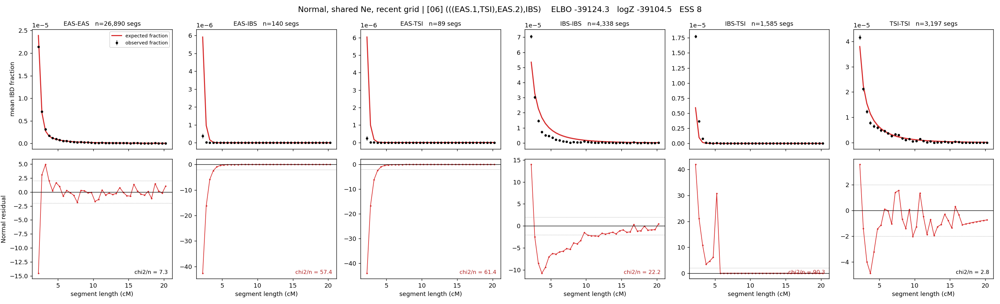

# `(((EAS.1,TSI),EAS.2),IBS)`

**Normal, shared Ne, recent grid** | topology 06 of 21 | admixed leaf: **EAS** | 4 events, 8 nodes

> Recent Ne grid: 0-5 and 5-10 generations. The first demographic event is explicitly constrained to occur after generation 10 (minimum 11 with the current one-generation gap).

## Model score

| quantity | value | |
|---|---|---|
| ELBO | -39124.32 | +- 0.30 (MC) |
| logZ (importance sampling) | -39104.46 | |
| ESS of the IS weights | 8.4 / 4000 | LOW -- treat logZ with suspicion |
| Stan dropped-constant correction | -29.61 | already applied |
| seed kept / runtime | 1 | 17 s |

## Events (in temporal order, most recent first)

| # | type | detail | time (gen) | cumulative |
|---|---|---|---|---|
| 1 | ADMIXTURE | EAS -> EAS.1 + EAS.2 | 170.8 +- 0.7 | 170.8 |
| 2 | MERGE | EAS.2 + TSI -> n1 | 3.2 +- 0.1 | 174.0 |
| 3 | MERGE | EAS.1 + n1 -> n2 | 1.0 +- 0.0 | 175.0 |
| 4 | MERGE | n2 + IBS -> root | 1.0 +- 0.0 | 176.1 |

## Admixture fraction

**f = 0.002 +- 0.000** (fraction from `EAS.1`; 0.998 from `EAS.2`)

Collapsed to a tree: one source carries <5% of the ancestry, so this graph is behaving as its no-admixture special case.

## Recent effective sizes shared by IBD and SNP (haploid)

| population | 0-5 gen | 5-10 gen |
|---|---:|---:|
| `EAS` | 4,381,373 | 3,855,813 |
| `IBS` | 6,151,068 | 3,525,664 |
| `TSI` | 2,814,739 | 1,918,577 |

## Effective sizes shared by IBD and SNP (haploid)

| node | Ne | sd of log Ne |
|---|---|---|
| `EAS` | 2,401,889 | 0.06 |
| `IBS` | 204,700 | 0.03 |
| `TSI` | 305,615 | 0.05 |
| `EAS.1` | 293,547 | 0.16 |
| `EAS.2` | 1,454 | 0.08 |
| `n1` | 103,202 | 0.08 |
| `n2` | 89,882 | 0.04 |
| `root` | 27,892 | 0.02 |

log-Ne random-walk step scale tau = 3.023

## Fit quality by component

| component | log-likelihood | n terms | chi2/n |
|---|---|---|---|
| IBD | -176.1 | 222 | 40.41 |
| SNP | -38,704.0 | 6 | 12915.89 |

IBD chi2/n uses Palamara model-derived Normal variance; SNP chi2/n uses its block SEs. Values near 1 indicate residuals on the modeled noise scale.

## SNP covariance residuals `(w_hat - W_pred)/w_se`

| | EAS | IBS | TSI |
|---|---|---|---|
| **EAS** | +115.95 | -113.99 | -115.20 |
| **IBS** | -113.99 | +110.18 | +114.58 |
| **TSI** | -115.20 | +114.58 | +111.87 |

