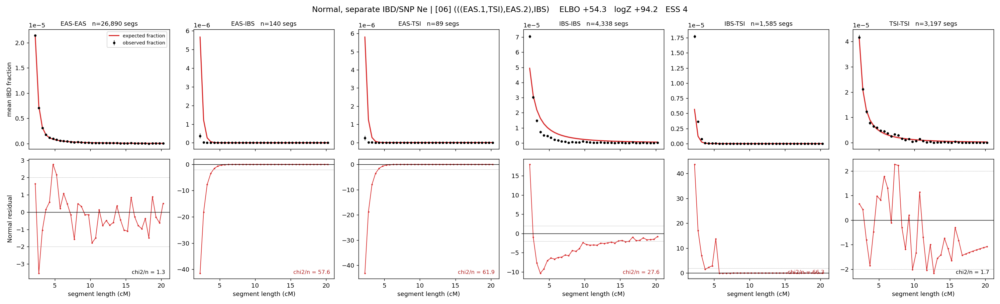

# `(((EAS.1,TSI),EAS.2),IBS)`

**Normal, separate IBD/SNP Ne** | topology 06 of 21 | admixed leaf: **EAS** | 4 events, 8 nodes

## Model score

| quantity | value | |
|---|---|---|
| ELBO | +54.26 | +- 0.65 (MC) |
| logZ (importance sampling) | +94.20 | |
| ESS of the IS weights | 4.4 / 4000 | LOW -- treat logZ with suspicion |
| Stan dropped-constant correction | -29.78 | already applied |
| mode kept / MAP start / runtime | 1 / 6 | 20 s |
| mode search | 12/12 MAP starts succeeded | 3 distinct modes evaluated |

## Events (in temporal order, most recent first)

| # | type | detail | time (gen) | cumulative |
|---|---|---|---|---|
| 1 | ADMIXTURE | EAS -> EAS.1 + EAS.2 | 125.2 +- 0.6 | 125.2 |
| 2 | MERGE | EAS.2 + TSI -> n1 | 4.2 +- 0.1 | 129.4 |
| 3 | MERGE | EAS.1 + n1 -> n2 | 17.9 +- 0.2 | 147.3 |
| 4 | MERGE | n2 + IBS -> root | 1.0 +- 0.0 | 148.3 |

## Admixture fraction

**f = 1.000 +- 0.000** (fraction from `EAS.1`; 0.000 from `EAS.2`)

Collapsed to a tree: one source carries <5% of the ancestry, so this graph is behaving as its no-admixture special case.

## Effective sizes for IBD (haploid)

| node | Ne | sd of log Ne |
|---|---|---|
| `EAS` | 2,701,275 | 0.04 |
| `IBS` | 219,147 | 0.03 |
| `TSI` | 415,954 | 0.06 |
| `EAS.1` | 35,852 | 0.04 |
| `EAS.2` | 25,816 | 0.04 |
| `n1` | 25,443 | 0.04 |
| `n2` | 100,084 | 0.01 |
| `root` | 72,884 | 0.01 |

log-Ne random-walk step scale tau_ibd = 1.226

## Effective sizes for SNP (haploid)

| node | Ne | sd of log Ne |
|---|---|---|
| `EAS` | 712 | 0.03 |
| `IBS` | 94,385 | 0.10 |
| `TSI` | 164,483 | 0.06 |
| `EAS.1` | 4,991 | 0.02 |
| `EAS.2` | 36,481 | 0.03 |
| `n1` | 36,114 | 0.03 |
| `n2` | 17,147 | 0.01 |
| `root` | 16,069 | 0.01 |

log-Ne random-walk step scale tau_snp = 0.922

## Fit quality by component

| component | log-likelihood | n terms | chi2/n |
|---|---|---|---|
| IBD | +222.8 | 222 | 36.25 |
| SNP | +24.0 | 6 | 6.54 |

IBD chi2/n uses Palamara model-derived Normal variance; SNP chi2/n uses its block SEs. Values near 1 indicate residuals on the modeled noise scale.

## SNP covariance residuals `(w_hat - W_pred)/w_se`

| | EAS | IBS | TSI |
|---|---|---|---|
| **EAS** | -0.02 | +0.26 | -0.22 |
| **IBS** | +0.26 | -0.77 | +0.30 |
| **TSI** | -0.22 | +0.30 | +0.13 |

