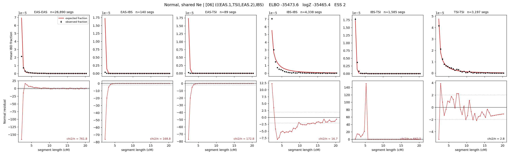

# `(((EAS.1,TSI),EAS.2),IBS)`

**Normal, shared Ne** | topology 06 of 21 | admixed leaf: **EAS** | 4 events, 8 nodes

## Model score

| quantity | value | |
|---|---|---|
| ELBO | -35473.56 | +- 0.08 (MC) |
| logZ (importance sampling) | -35465.41 | |
| ESS of the IS weights | 2.4 / 4000 | LOW -- treat logZ with suspicion |
| Stan dropped-constant correction | -24.10 | already applied |
| mode kept / MAP start / runtime | 1 / 11 | 18 s |
| mode search | 12/12 MAP starts succeeded | 3 distinct modes evaluated |

## Events (in temporal order, most recent first)

| # | type | detail | time (gen) | cumulative |
|---|---|---|---|---|
| 1 | ADMIXTURE | EAS -> EAS.1 + EAS.2 | 244.6 +- 0.1 | 244.6 |
| 2 | MERGE | EAS.2 + TSI -> n1 | 1.0 +- 0.0 | 245.6 |
| 3 | MERGE | EAS.1 + n1 -> n2 | 1.0 +- 0.0 | 246.7 |
| 4 | MERGE | n2 + IBS -> root | 1.0 +- 0.0 | 247.7 |

## Admixture fraction

**f = 0.998 +- 0.000** (fraction from `EAS.1`; 0.002 from `EAS.2`)

Collapsed to a tree: one source carries <5% of the ancestry, so this graph is behaving as its no-admixture special case.

## Effective sizes shared by IBD and SNP (haploid)

| node | Ne | sd of log Ne |
|---|---|---|
| `EAS` | 3,248,833 | 0.03 |
| `IBS` | 262,178 | 0.03 |
| `TSI` | 414,831 | 0.03 |
| `EAS.1` | 20 | 0.01 |
| `EAS.2` | 81 | 0.01 |
| `n1` | 81 | 0.01 |
| `n2` | 4,192 | 0.01 |
| `root` | 764 | 0.00 |

log-Ne random-walk step scale tau = 4.371

## Fit quality by component

| component | log-likelihood | n terms | chi2/n |
|---|---|---|---|
| IBD | -28,302.8 | 222 | 294.29 |
| SNP | -6,831.2 | 6 | 2291.61 |

IBD chi2/n uses Palamara model-derived Normal variance; SNP chi2/n uses its block SEs. Values near 1 indicate residuals on the modeled noise scale.

## SNP covariance residuals `(w_hat - W_pred)/w_se`

| | EAS | IBS | TSI |
|---|---|---|---|
| **EAS** | +49.30 | -54.19 | -43.22 |
| **IBS** | -54.19 | +41.09 | +66.57 |
| **TSI** | -43.22 | +66.57 | +19.79 |

