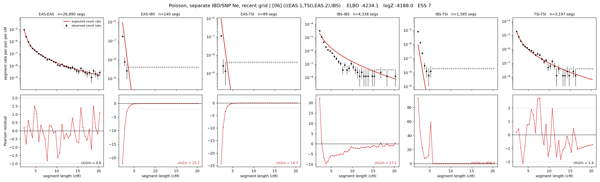

# `(((EAS.1,TSI),EAS.2),IBS)`

**Poisson, separate IBD/SNP Ne, recent grid** | topology 06 of 21 | admixed leaf: **EAS** | 4 events, 8 nodes

> Recent Ne grid: 0-5 and 5-10 generations. The first demographic event is explicitly constrained to occur after generation 10 (minimum 11 with the current one-generation gap).

## Model score

| quantity | value | |
|---|---|---|
| ELBO | -4234.11 | +- 1.06 (MC) |
| logZ (importance sampling) | -4188.02 | |
| ESS of the IS weights | 7.3 / 4000 | LOW -- treat logZ with suspicion |
| Stan dropped-constant correction | -40.81 | already applied |
| mode kept / MAP start / runtime | 1 / 5 | 25 s |
| mode search | 12/12 MAP starts succeeded | 3 distinct modes evaluated |

## Events (in temporal order, most recent first)

| # | type | detail | time (gen) | cumulative |
|---|---|---|---|---|
| 1 | ADMIXTURE | EAS -> EAS.1 + EAS.2 | 136.4 +- 1.4 | 136.4 |
| 2 | MERGE | EAS.2 + TSI -> n1 | 10.6 +- 0.1 | 147.0 |
| 3 | MERGE | EAS.1 + n1 -> n2 | 31.9 +- 0.5 | 178.9 |
| 4 | MERGE | n2 + IBS -> root | 1.1 +- 0.0 | 180.0 |

## Admixture fraction

**f = 1.000 +- 0.000** (fraction from `EAS.1`; 0.000 from `EAS.2`)

Collapsed to a tree: one source carries <5% of the ancestry, so this graph is behaving as its no-admixture special case.

## Recent effective sizes for IBD (haploid)

| population | 0-5 gen | 5-10 gen |
|---|---:|---:|
| `EAS` | 4,708,339 | 3,761,523 |
| `IBS` | 4,115,021 | 2,526,982 |
| `TSI` | 2,015,540 | 1,375,943 |

## Effective sizes for IBD (haploid)

| node | Ne | sd of log Ne |
|---|---|---|
| `EAS` | 2,418,213 | 0.06 |
| `IBS` | 223,396 | 0.06 |
| `TSI` | 386,307 | 0.06 |
| `EAS.1` | 29,370 | 0.03 |
| `EAS.2` | 23,121 | 0.05 |
| `n1` | 19,127 | 0.05 |
| `n2` | 119,326 | 0.04 |
| `root` | 69,599 | 0.04 |

log-Ne random-walk step scale tau_ibd = 2.070

## Recent effective sizes for SNP (haploid)

| population | 0-5 gen | 5-10 gen |
|---|---:|---:|
| `EAS` | 836 | 832 |
| `IBS` | 167,399 | 155,005 |
| `TSI` | 188,859 | 184,098 |

## Effective sizes for SNP (haploid)

| node | Ne | sd of log Ne |
|---|---|---|
| `EAS` | 782 | 0.03 |
| `IBS` | 140,356 | 0.04 |
| `TSI` | 170,895 | 0.03 |
| `EAS.1` | 6,306 | 0.01 |
| `EAS.2` | 44,453 | 0.02 |
| `n1` | 44,923 | 0.02 |
| `n2` | 23,094 | 0.01 |
| `root` | 20,597 | 0.01 |

log-Ne random-walk step scale tau_snp = 1.033

## Fit quality by component

| component | log-likelihood | n terms | chi2/n |
|---|---|---|---|
| IBD | -3,983.2 | 222 | 78.96 |
| SNP | +27.4 | 6 | 5.40 |

IBD chi2/n uses Poisson counting variance; SNP chi2/n uses its block SEs. Values near 1 indicate residuals on the modeled noise scale.

## SNP covariance residuals `(w_hat - W_pred)/w_se`

| | EAS | IBS | TSI |
|---|---|---|---|
| **EAS** | -0.05 | -0.01 | +0.10 |
| **IBS** | -0.01 | -0.19 | +0.21 |
| **TSI** | +0.10 | +0.21 | -0.40 |

