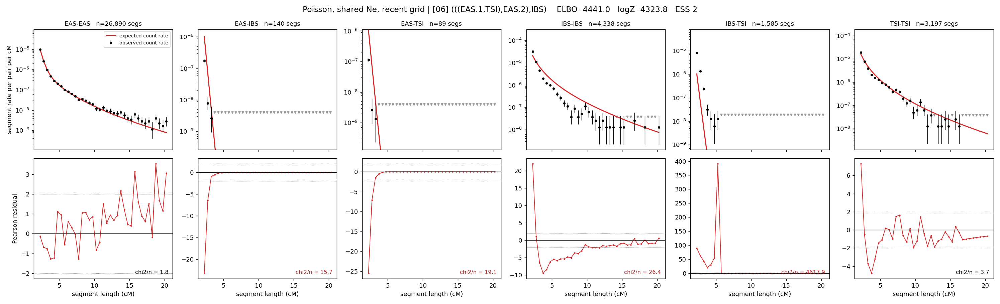

# `(((EAS.1,TSI),EAS.2),IBS)`

**Poisson, shared Ne, recent grid** | topology 06 of 21 | admixed leaf: **EAS** | 4 events, 8 nodes

> Recent Ne grid: 0-5 and 5-10 generations. The first demographic event is explicitly constrained to occur after generation 10 (minimum 11 with the current one-generation gap).

## Model score

| quantity | value | |
|---|---|---|
| ELBO | -4441.00 | +- 1.94 (MC) |
| logZ (importance sampling) | -4323.77 | |
| ESS of the IS weights | 1.6 / 4000 | LOW -- treat logZ with suspicion |
| Stan dropped-constant correction | -29.61 | already applied |
| mode kept / MAP start / runtime | 1 / 11 | 26 s |
| mode search | 12/12 MAP starts succeeded | 3 distinct modes evaluated |

## Events (in temporal order, most recent first)

| # | type | detail | time (gen) | cumulative |
|---|---|---|---|---|
| 1 | ADMIXTURE | EAS -> EAS.1 + EAS.2 | 127.7 +- 1.9 | 127.7 |
| 2 | MERGE | EAS.2 + TSI -> n1 | 115.8 +- 7.4 | 243.5 |
| 3 | MERGE | EAS.1 + n1 -> n2 | 1.2 +- 0.0 | 244.7 |
| 4 | MERGE | n2 + IBS -> root | 1.0 +- 0.0 | 245.7 |

## Admixture fraction

**f = 0.008 +- 0.003** (fraction from `EAS.1`; 0.992 from `EAS.2`)

Collapsed to a tree: one source carries <5% of the ancestry, so this graph is behaving as its no-admixture special case.

## Recent effective sizes shared by IBD and SNP (haploid)

| population | 0-5 gen | 5-10 gen |
|---|---:|---:|
| `EAS` | 29,574,354 | 26,604,340 |
| `IBS` | 4,963,538 | 3,326,121 |
| `TSI` | 3,881,270 | 2,696,770 |

## Effective sizes shared by IBD and SNP (haploid)

| node | Ne | sd of log Ne |
|---|---|---|
| `EAS` | 2,288,445 | 0.05 |
| `IBS` | 225,108 | 0.05 |
| `TSI` | 310,271 | 0.13 |
| `EAS.1` | 0 | 0.77 |
| `EAS.2` | 57,740 | 0.04 |
| `n1` | 13,178 | 0.23 |
| `n2` | 12,293 | 0.21 |
| `root` | 6,748 | 0.21 |

log-Ne random-walk step scale tau = 2.251

## Fit quality by component

| component | log-likelihood | n terms | chi2/n |
|---|---|---|---|
| IBD | -4,173.6 | 222 | 880.85 |
| SNP | -4.6 | 6 | 16.09 |

IBD chi2/n uses Poisson counting variance; SNP chi2/n uses its block SEs. Values near 1 indicate residuals on the modeled noise scale.

## SNP covariance residuals `(w_hat - W_pred)/w_se`

| | EAS | IBS | TSI |
|---|---|---|---|
| **EAS** | -0.31 | +0.59 | +0.02 |
| **IBS** | +0.59 | +0.14 | -1.36 |
| **TSI** | +0.02 | -1.36 | +1.24 |

