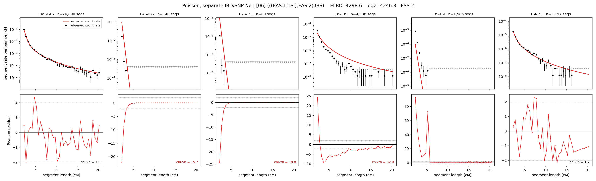

# `(((EAS.1,TSI),EAS.2),IBS)`

**Poisson, separate IBD/SNP Ne** | topology 06 of 21 | admixed leaf: **EAS** | 4 events, 8 nodes

## Model score

| quantity | value | |
|---|---|---|
| ELBO | -4298.58 | +- 0.86 (MC) |
| logZ (importance sampling) | -4246.31 | |
| ESS of the IS weights | 1.7 / 4000 | LOW -- treat logZ with suspicion |
| Stan dropped-constant correction | -29.78 | already applied |
| mode kept / MAP start / runtime | 1 / 11 | 18 s |
| mode search | 12/12 MAP starts succeeded | 3 distinct modes evaluated |

## Events (in temporal order, most recent first)

| # | type | detail | time (gen) | cumulative |
|---|---|---|---|---|
| 1 | ADMIXTURE | EAS -> EAS.1 + EAS.2 | 125.6 +- 4.6 | 125.6 |
| 2 | MERGE | EAS.2 + TSI -> n1 | 5.8 +- 0.8 | 131.4 |
| 3 | MERGE | EAS.1 + n1 -> n2 | 55.8 +- 9.9 | 187.2 |
| 4 | MERGE | n2 + IBS -> root | 1.1 +- 0.0 | 188.3 |

## Admixture fraction

**f = 1.000 +- 0.000** (fraction from `EAS.1`; 0.000 from `EAS.2`)

Collapsed to a tree: one source carries <5% of the ancestry, so this graph is behaving as its no-admixture special case.

## Effective sizes for IBD (haploid)

| node | Ne | sd of log Ne |
|---|---|---|
| `EAS` | 2,622,723 | 0.06 |
| `IBS` | 234,985 | 0.06 |
| `TSI` | 416,248 | 0.05 |
| `EAS.1` | 46,778 | 0.19 |
| `EAS.2` | 36,749 | 0.23 |
| `n1` | 35,789 | 0.22 |
| `n2` | 68,710 | 0.25 |
| `root` | 53,128 | 0.22 |

log-Ne random-walk step scale tau_ibd = 1.087

## Effective sizes for SNP (haploid)

| node | Ne | sd of log Ne |
|---|---|---|
| `EAS` | 746 | 0.03 |
| `IBS` | 163,872 | 0.16 |
| `TSI` | 199,774 | 0.04 |
| `EAS.1` | 5,388 | 0.11 |
| `EAS.2` | 53,086 | 0.07 |
| `n1` | 58,850 | 0.09 |
| `n2` | 26,903 | 0.12 |
| `root` | 27,292 | 0.13 |

log-Ne random-walk step scale tau_snp = 0.780

## Fit quality by component

| component | log-likelihood | n terms | chi2/n |
|---|---|---|---|
| IBD | -4,124.9 | 222 | 92.14 |
| SNP | +23.9 | 6 | 6.57 |

IBD chi2/n uses Poisson counting variance; SNP chi2/n uses its block SEs. Values near 1 indicate residuals on the modeled noise scale.

## SNP covariance residuals `(w_hat - W_pred)/w_se`

| | EAS | IBS | TSI |
|---|---|---|---|
| **EAS** | +0.05 | -0.17 | +0.08 |
| **IBS** | -0.17 | +0.14 | +0.20 |
| **TSI** | +0.08 | +0.20 | -0.33 |

