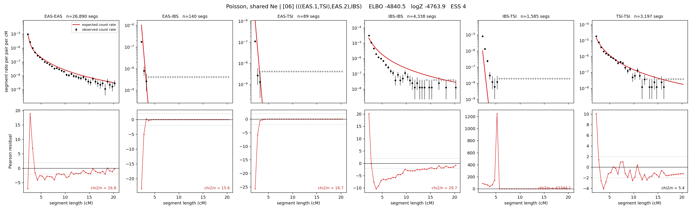

# `(((EAS.1,TSI),EAS.2),IBS)`

**Poisson, shared Ne** | topology 06 of 21 | admixed leaf: **EAS** | 4 events, 8 nodes

## Model score

| quantity | value | |
|---|---|---|
| ELBO | -4840.53 | +- 1.03 (MC) |
| logZ (importance sampling) | -4763.87 | |
| ESS of the IS weights | 4.5 / 4000 | LOW -- treat logZ with suspicion |
| Stan dropped-constant correction | -24.10 | already applied |
| mode kept / MAP start / runtime | 1 / 3 | 16 s |
| mode search | 10/12 MAP starts succeeded | 3 distinct modes evaluated |

## Events (in temporal order, most recent first)

| # | type | detail | time (gen) | cumulative |
|---|---|---|---|---|
| 1 | ADMIXTURE | EAS -> EAS.1 + EAS.2 | 219.8 +- 9.1 | 219.8 |
| 2 | MERGE | EAS.2 + TSI -> n1 | 62.8 +- 4.4 | 282.5 |
| 3 | MERGE | EAS.1 + n1 -> n2 | 1.1 +- 0.0 | 283.6 |
| 4 | MERGE | n2 + IBS -> root | 1.1 +- 0.0 | 284.7 |

## Admixture fraction

**f = 0.926 +- 0.012** (fraction from `EAS.1`; 0.074 from `EAS.2`)

## Effective sizes shared by IBD and SNP (haploid)

| node | Ne | sd of log Ne |
|---|---|---|
| `EAS` | 1,977,316 | 0.08 |
| `IBS` | 220,472 | 0.08 |
| `TSI` | 335,479 | 0.06 |
| `EAS.1` | 3,443 | 0.38 |
| `EAS.2` | 2 | 0.28 |
| `n1` | 1,848 | 0.12 |
| `n2` | 1,906 | 0.13 |
| `root` | 1,593 | 0.15 |

log-Ne random-walk step scale tau = 1.363

## Fit quality by component

| component | log-likelihood | n terms | chi2/n |
|---|---|---|---|
| IBD | -4,688.2 | 222 | 7971.83 |
| SNP | +26.7 | 6 | 5.65 |

IBD chi2/n uses Poisson counting variance; SNP chi2/n uses its block SEs. Values near 1 indicate residuals on the modeled noise scale.

## SNP covariance residuals `(w_hat - W_pred)/w_se`

| | EAS | IBS | TSI |
|---|---|---|---|
| **EAS** | -0.59 | +0.90 | +0.26 |
| **IBS** | +0.90 | -2.00 | +0.30 |
| **TSI** | +0.26 | +0.30 | -0.78 |

