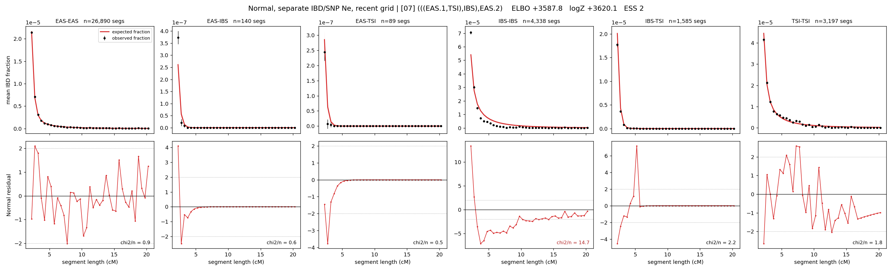

# `(((EAS.1,TSI),IBS),EAS.2)`

**Normal, separate IBD/SNP Ne, recent grid** | topology 07 of 21 | admixed leaf: **EAS** | 4 events, 8 nodes

> Recent Ne grid: 0-5 and 5-10 generations. The first demographic event is explicitly constrained to occur after generation 10 (minimum 11 with the current one-generation gap).

## Model score

| quantity | value | |
|---|---|---|
| ELBO | +3587.77 | +- 0.46 (MC) |
| logZ (importance sampling) | +3620.09 | |
| ESS of the IS weights | 1.7 / 4000 | LOW -- treat logZ with suspicion |
| Stan dropped-constant correction | -40.81 | already applied |
| seed kept / runtime | 1 | 25 s |

## Events (in temporal order, most recent first)

| # | type | detail | time (gen) | cumulative |
|---|---|---|---|---|
| 1 | ADMIXTURE | EAS -> EAS.1 + EAS.2 | 140.6 +- 0.5 | 140.6 |
| 2 | MERGE | EAS.2 + TSI -> n1 | 4.0 +- 0.1 | 144.6 |
| 3 | MERGE | n1 + IBS -> n2 | 3.9 +- 0.1 | 148.6 |
| 4 | MERGE | EAS.1 + n2 -> root | 497.5 +- 5.6 | 646.0 |

## Admixture fraction

**f = 0.987 +- 0.001** (fraction from `EAS.1`; 0.013 from `EAS.2`)

Collapsed to a tree: one source carries <5% of the ancestry, so this graph is behaving as its no-admixture special case.

## Recent effective sizes for IBD (haploid)

| population | 0-5 gen | 5-10 gen |
|---|---:|---:|
| `EAS` | 4,859,703 | 4,447,814 |
| `IBS` | 386,673 | 366,890 |
| `TSI` | 544,034 | 506,869 |

## Effective sizes for IBD (haploid)

| node | Ne | sd of log Ne |
|---|---|---|
| `EAS` | 2,291,828 | 0.02 |
| `IBS` | 281,828 | 0.05 |
| `TSI` | 422,593 | 0.03 |
| `EAS.1` | 29,413 | 0.01 |
| `EAS.2` | 29,437 | 0.03 |
| `n1` | 29,263 | 0.03 |
| `n2` | 20,332 | 0.03 |
| `root` | 4,677 | 0.01 |

log-Ne random-walk step scale tau_ibd = 0.681

## Recent effective sizes for SNP (haploid)

| population | 0-5 gen | 5-10 gen |
|---|---:|---:|
| `EAS` | 521 | 583 |
| `IBS` | 72,832 | 80,575 |
| `TSI` | 69,022 | 75,047 |

## Effective sizes for SNP (haploid)

| node | Ne | sd of log Ne |
|---|---|---|
| `EAS` | 987 | 0.02 |
| `IBS` | 108,871 | 0.05 |
| `TSI` | 100,531 | 0.05 |
| `EAS.1` | 17,384 | 0.01 |
| `EAS.2` | 336,377 | 0.06 |
| `n1` | 337,123 | 0.06 |
| `n2` | 408,147 | 0.06 |
| `root` | 27,416 | 0.01 |

log-Ne random-walk step scale tau_snp = 0.363

## Fit quality by component

| component | log-likelihood | n terms | chi2/n |
|---|---|---|---|
| IBD | +3,895.8 | 222 | 3.58 |
| SNP | +32.1 | 6 | 3.83 |

IBD chi2/n uses Palamara model-derived Normal variance; SNP chi2/n uses its block SEs. Values near 1 indicate residuals on the modeled noise scale.

## SNP covariance residuals `(w_hat - W_pred)/w_se`

| | EAS | IBS | TSI |
|---|---|---|---|
| **EAS** | +0.15 | -0.13 | -0.17 |
| **IBS** | -0.13 | -0.16 | +0.42 |
| **TSI** | -0.17 | +0.42 | -0.08 |

