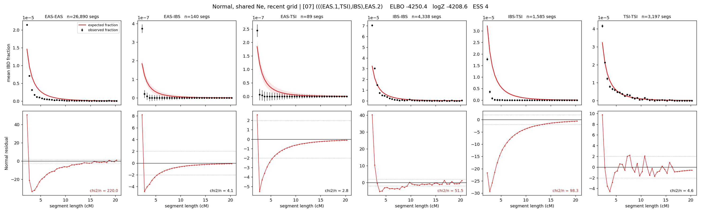

# `(((EAS.1,TSI),IBS),EAS.2)`

**Normal, shared Ne, recent grid** | topology 07 of 21 | admixed leaf: **EAS** | 4 events, 8 nodes

> Recent Ne grid: 0-5 and 5-10 generations. The first demographic event is explicitly constrained to occur after generation 10 (minimum 11 with the current one-generation gap).

## Model score

| quantity | value | |
|---|---|---|
| ELBO | -4250.37 | +- 0.77 (MC) |
| logZ (importance sampling) | -4208.62 | |
| ESS of the IS weights | 4.2 / 4000 | LOW -- treat logZ with suspicion |
| Stan dropped-constant correction | -29.61 | already applied |
| seed kept / runtime | 13 | 18 s |

## Events (in temporal order, most recent first)

| # | type | detail | time (gen) | cumulative |
|---|---|---|---|---|
| 1 | ADMIXTURE | EAS -> EAS.1 + EAS.2 | 11.0 +- 0.0 | 11.0 |
| 2 | MERGE | EAS.2 + TSI -> n1 | 1.0 +- 0.0 | 12.0 |
| 3 | MERGE | n1 + IBS -> n2 | 1.0 +- 0.0 | 13.0 |
| 4 | MERGE | EAS.1 + n2 -> root | 38,271.3 +- 163.6 | 38,284.3 |

## Admixture fraction

**f = 0.994 +- 0.001** (fraction from `EAS.1`; 0.006 from `EAS.2`)

Collapsed to a tree: one source carries <5% of the ancestry, so this graph is behaving as its no-admixture special case.

## Recent effective sizes shared by IBD and SNP (haploid)

| population | 0-5 gen | 5-10 gen |
|---|---:|---:|
| `EAS` | 54,732,471 | 31,252,937 |
| `IBS` | 5,789,487 | 3,557,034 |
| `TSI` | 6,882,049 | 4,550,632 |

## Effective sizes shared by IBD and SNP (haploid)

| node | Ne | sd of log Ne |
|---|---|---|
| `EAS` | 2,323,495 | 0.05 |
| `IBS` | 826,263 | 0.02 |
| `TSI` | 1,073,998 | 0.02 |
| `EAS.1` | 669,988 | 0.04 |
| `EAS.2` | 495,888 | 0.02 |
| `n1` | 493,193 | 0.02 |
| `n2` | 303,952 | 0.01 |
| `root` | 23,312 | 0.03 |

log-Ne random-walk step scale tau = 2.801

## Fit quality by component

| component | log-likelihood | n terms | chi2/n |
|---|---|---|---|
| IBD | -3,604.7 | 222 | 63.86 |
| SNP | +18.1 | 6 | 8.50 |

IBD chi2/n uses Palamara model-derived Normal variance; SNP chi2/n uses its block SEs. Values near 1 indicate residuals on the modeled noise scale.

## SNP covariance residuals `(w_hat - W_pred)/w_se`

| | EAS | IBS | TSI |
|---|---|---|---|
| **EAS** | -0.01 | +0.07 | -0.05 |
| **IBS** | +0.07 | +3.58 | -3.98 |
| **TSI** | -0.05 | -3.98 | +3.85 |

